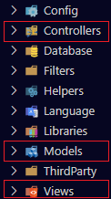
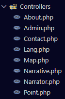
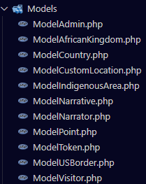
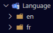

<p align="center">
  
</p>
<br><br>

# Slave Narratives - Documentation technique

<i>Présentée par :

- Esteban BIRET-TOSCANO
- Rémy GUIBERT
- Cédric-Alexandre PASCAL
- Mickael FERNANDEZ</i>

## Sommaire

- [Slave Narratives - Documentation technique](#slave-narratives---documentation-technique)
  - [Sommaire](#sommaire)
  - [Introduction](#introduction)
  - [Environnement de développement et architecture](#environnement-de-développement-et-architecture)
  - [Esthétique du site](#esthétique-du-site)
    - [Page d'accueil/carte](#page-daccueilcarte)
    - [Page de contact](#page-de-contact)
  - [Partie back-office](#partie-back-office)
    - [Système de connexion](#système-de-connexion)
      - [Cookie](#cookie)
      - [Mot de passe oublié](#mot-de-passe-oublié)
      - [Déconnexion](#déconnexion)
    - [CRUD - Admin](#crud---admin)
      - [Page d'administration](#page-dadministration)
      - [Créer un·e administrateur·rice](#créer-une-administrateurrice)
      - [Modifier mon adresse e-mail](#modifier-mon-adresse-e-mail)
      - [Modifier mon mot de passe](#modifier-mon-mot-de-passe)
      - [Supprimer un·e administrateur·rice](#supprimer-une-administrateurrice)
      - [Page des statistiques](#page-des-statistiques)
    - [CRUD - Esclave/Narrateur](#crud---esclavenarrateur)
      - [Recensement des esclaves/narrateurs](#recensement-des-esclavesnarrateurs)
        - [Ajout des points](#ajout-des-points)
      - [Modifier un esclave/narrateur](#modifier-un-esclavenarrateur)
      - [Supprimer un esclave/narrateur](#supprimer-un-esclavenarrateur)
    - [CRUD - Récit](#crud---récit)
        - [Liste des récits](#liste-des-récits)
        - [Page d'un récit](#page-dun-récit)
        - [Exportation PDF d'un récit](#exportation-pdf-dun-récit)
        - [Ajouter/modifier un récit](#ajoutermodifier-un-récit)
          - [Ajout d'une zone géographique](#ajout-dune-zone-géographique)
        - [Supprimer un récit](#supprimer-un-récit)
    - [Langues (FR/EN)](#langues-fren)

## Introduction

Cette documentation technique se focalise sur l'aspect technique du site <i>"Slave Narratives"</i>, un site web d'abord développé par des Master SIGMA, puis repris par nous dans le  cadre d'une Situation d'Apprentissage et d'Évaluation (SAÉ). Notre objectif visait à améliorer le site web existant, qui regroupe de manière exhaustive de nombreux récits d'esclaves, en proposant une plateforme plus immersive et conviviale pour les administrateurs.

Actuellement, l'exploration des récits s'effectue à travers diverses approches : 
- La localisation sur une carte interactive du monde,
- La découverte au fil d'une liste exhaustive,
- Le ciblage à l'aide de filtres spécifiques.

L'objectif primordial de cette rénovation est l'intégration d'un back-office, une facette cruciale dont les détails sont explicités dans la partie adéquate.

Ainsi, cette documentation technique met l'accent sur l'aspect code du projet, visant à fournir une compréhension détaillée de la mise en œuvre des différentes fonctionnalités. Vous trouverez des exemples concrets de code qui démontreront la démarche technique sous-jacente à chaque fonctionnalité améliorée.

## Environnement de développement et architecture

À la base du fonctionnement du site, on retrouve un serveur PHP et MySQL, avec PhpMyAdmin pour l'administration de la BD.
Mais ce n'est pas tout, le site n'est pas en pur PHP, le framework [CodeIgniter](https://github.com/codeigniter4/CodeIgniter4) (abrégé CI) est installé.

Arborescence du site  et fichier importants :
```txt
app/: dossier du projet CI
 | Config: configuration du projet CI
 |    | App.php: configuration générale
 |    | Database.php: configuration da la connexion à la BD
 |    | Routes.php: définition des routes
 | Controllers: classes/méthodes appelées par les routes, font appel aux modèles/vues
 | Language: fichiers de langues
 | Models: classes qui font le lien avec les tables de la BD
 \ Views: vues du site (contient quelques fichiers de traitement)
PHPMailer/: bibliothèque pour l'envoi de mail
public/: dossier des ressources multi-média accessible par URL
system/: code de CI
writable/: logs de CI
.env: un autre fichier de config du projet CI
```

À chaque création ou édition d'une page sur le site web, il faut penser à sa <b>route</b>. Une route, c'est ce qui correspond aux itinéraires des URL vers les contrôleurs et méthodes correspondantes. Le fichier ``Routes.php`` (situé parmi les autres fichiers de configuration de <b>CodeIgniter</b>, le framework utilisé pour ce site) contient alors des instructions qui permettent à <b>CodeIgniter</b> de comprendre quel contrôleur et quelle méthode doivent être appelés en fonction de l'URL demandée.
Nous avons deux type de routes dans notre code. 
- Les routes utilisant la méthode GET (qui récupèrent des données pour ensuite afficher du contenu) :

      $routes->get('/narrative/list', [Narrative::class, 'list']);

- Et les routes utilisant les méthodes GET & POST (qui récupèrent des données et peuvent aussi en transmettre, comme les formulaires) : 

      $routes->match(['get', 'post'], '/narrative/create', [Narrative::class, 'createOrEdit']);

Comme déjà évoqué dans les rapports de projet d'anciens étudiants ayant travaillé sur ce même projet, <b>CodeIgniter</b> se base sur l'architecture <b>MVC</b> qui favorise une séparation claire des préoccupations, facilitant ainsi la gestion du code, la réutilisation des composants et la maintenance de l'application :

- Le <b>Modèle</b> est responsable de la manipulation des données, des requêtes à la base de données, des opérations de validation et de tout ce qui concerne la logique métier.
- La <b>Vue</b> est la couche d'interface utilisateur de l'application. Elle est chargée de l'affichage des données au format approprié pour l'utilisateur.
- Le <b>Contrôleur</b> est l'intermédiaire entre le modèle et la vue. Il reçoit les requêtes de l'utilisateur, traite les données nécessaires via les modèles, et choisit la vue appropriée pour afficher les résultats. Pour chaque route, une fonction lui est dédiée dans le contrôleur.

<p align="center">
  
</p>

## Esthétique du site

Pour les pages ayant seulement subi des changements sur le côté "esthétique", seule les fichiers d'affichage (situés dans la vue) et les fichiers de stylisation seront utilisés. Pour d'autres pages dont l'esthétique <u>ainsi que</u> le contenu diffèrent, des fichiers de traitement (également situés dans la vue) seront aussi sollicités. Étant donné que ces pages existaient déjà, il n'y nulle nécessité à utiliser le contrôleur (bien qu'une refonte sur la dissociation des fichiers importants a été réalisée, tout comme dans le modèle).

<p align="center">
  
  
</p>

### Page d'accueil/carte

L'affichage de l'accueil/carte est divisé en deux parties, une partie qui affiche la carte et les informations qu'elle
contient et une autre qui affiche une barre latérale avec deux champs de recherche et une légende.

Ces deux champs de recherche sont pour rechercher par type de lieu et par récit.

La carte a deux fichiers d'affichage, une pour les récits et une pour les types de lieu, il serait bien plus
judicieux de faire un seul fichier pour les deux, mais ce n'est pas nous qui avont écrit ce code et n'avons pas pris le
temps de comprendre toutes ces lignes de codes, donc je vais seulement pouvoir vous expliquer leur fonctionnement dans
les grandes lignes.

Tout d'abord dans le contrôleur (`Map.php`), qui est donc séparé en deux conditions, une pour la
recherche par type de lieu et une autre par récit, mais dans les deux cas on récupère la liste des récits (L33 et L60),
puisqu'ils doivent être affichés dans la barre latérale afin de filtrer par récits.
La recherche marche en envoyant les données des formulaires en mode `GET` donc on récupère le type de lieu avec
`$_GET['place']` et le récit avec `$_GET['narrative']`, ces données sont utilisées dans la condition appropriée afin de
récupérer les points et zones géographiques correspondant au lieu ou au récit (L31-39 pour la récupération des données
d'un récit et L58-64 pour celles d'un type de lieu).

Ensuite, concernant les fichiers d'affichage, on commence par initialiser la carte (`places.php` L5-52 et `narrative.php`
L6-51), puis on formate les données du lieu/récit (`places.php` L54-99 et `narrative.php` L56-129), après on charge du
style pour la carte (`places.php` L101-110 et `narrative.php` L133-201, le style est dans `style.js`) puis on ajoute
toutes les données à la carte (`places.php` L112-184 et `narrative.php` L203-309) avec notamment l'affichage de pop-ups
(`places.php` L120-134 et `narrative.php` L226-239).

### Page de contact

Le fichier ``contact.php`` contient un formulaire constitués de différents champs tels que le nom et prénom, l'e-mail ou encore le sujet et le message car en effet, ces informations seront envoyées par mail à l'adresse mail de l'administrateur·rice. En règle générale, les formulaires sont accompagnés de fichiers de traitement pour dissocier la partie visuelle de la partie fonctionnelle.

```php
<label for="first_name"><?= lang('Contact.first_name') ?></label>
<input type="text" class="contact-inputs" name="first_name" placeholder="<?= lang('Contact.first_name') ?>" required minlength="2" value="<?= $first_name ?>"/>

<label for="last_name"><?= lang('Contact.last_name') ?></label>
<input type="text" class="contact-inputs" name="last_name" placeholder="<?= lang('Contact.last_name') ?>" required minlength="2" value="<?= $last_name ?>"/>

<label for="email"><?= lang('Contact.email') ?></label>
<input type="email" class="contact-inputs" name="email" placeholder="<?= lang('Contact.email') ?>" required minlength="5" value="<?= $email ?>"/>

<label for="subject"><?= lang('Contact.subject') ?></label>
<input type="text" class="contact-inputs" name="subject" placeholder="<?= lang('Contact.subject') ?>" required minlength="2" value="<?= $subject ?>"/>

<label for="message"><?= lang('Contact.message') ?></label>
<textarea class="last-champ-contact" name="message" placeholder="<?= lang('Contact.message') ?>" required maxlength="65535"><?= $message ?></textarea>

<input id="button-contact" type="submit" name="envoyer" value="<?= lang('Contact.send') ?>">
[...]
```

Si une erreur vient à être signalée sur l'un de ces champs (généralement liée à la conformité du message dans un champ via un système de <b>regex</b> ou si un champ n'est pas renseigné), la session ``erreur-contact`` viendra la récupérer pour l'afficher dans la page de contact.

```php
if(!($_SERVER['REQUEST_METHOD'] == 'POST' && isset($_POST['last_name']) && $_POST['last_name'] != "" && isset($_POST['first_name']) && $_POST['first_name'] != "" &&
        isset($_POST['email']) && $_POST['email'] != "" && isset($_POST['subject']) && $_POST['subject'] != "" && isset($_POST['message']) && $_POST['message'] != "" )) {

        $_SESSION['erreur-contact'] = lang('TraitContact.fields');
        header('location:' . base_url('/contact'));
        exit;
    }

    $_SESSION['contact_values'] = $_POST;
    $last_name = htmlspecialchars($_POST['last_name']);
    $first_name = htmlspecialchars($_POST['first_name']);
    $email = htmlspecialchars($_POST['email']);
    $subject = htmlentities($_POST['subject']);
    $message = htmlentities($_POST['message']);

    if (!preg_match("#^[\p{L}'\-\s]+$#u", $last_name)) {
        $_SESSION['erreur-contact'] = lang('TraitContact.error-l_name');
        header('location:' . base_url('/contact'));
        exit; 
    }

    if (!preg_match("#^[\p{L}'\-\s]+$#u", $first_name)) {
        $_SESSION['erreur-contact'] = lang('TraitContact.error-f_name');
        header('location:' . base_url('/contact'));
        exit; 
    }

    if (!preg_match('#^[a-z0-9._-]+@[a-z0-9._-]{2,}\.[a-z]{2,4}$#', $email)) {
        $_SESSION['erreur-contact'] = lang('TraitContact.error_email');
        header('location:' . base_url('/contact'));
        exit; 
    }
[...]
```

Une autre session, nommée ``contact_values`` vient récupérer quant à elle l'ensemble des informations renseignées par l'utilisateur. Elle sert concrètement à laisser ces informations de manière persistante sur les champs de texte, évitant pour l'internaute de remplir à nouveau ces champs.  

```php
<?php
    // Récupérer le message d'erreur s'il existe
    $erreur_contact = isset($_SESSION['erreur-contact']) ? $_SESSION['erreur-contact'] : '';
    // Récupérer le message de fin s'il existe
    $msg_contact = isset($_SESSION['msg-contact']) ? $_SESSION['msg-contact'] : '';
    // Effacement des variables de session
    unset($_SESSION['erreur-contact']);
    unset($_SESSION['msg-contact']);

    if (!empty($erreur_contact)) {
        echo('<p class="error-message">'.$erreur_contact.'</p>');
    }
    if (!empty($msg_contact)) {
        echo('<p class="password-oublie-message">'.$msg_contact.'</p>');
    }

?>

<body>

    <div class="form">

        <form method="POST" action="<?= base_url('/traitContact'); ?>">

            <h3><?= lang('HeaderFooter.contact')?></h3>

            <?php  
            $first_name = '';
            $last_name = '';
            $email = '';
            $subject = '';
            $message = '';

            if (isset($_SESSION['contact_values'])) {

                $contactValues = $_SESSION['contact_values'];

                // Récupérer les valeurs de la session
                $first_name = isset($contactValues['first_name']) ? $contactValues['first_name'] : '';
                $last_name = isset($contactValues['last_name']) ? $contactValues['last_name'] : '';
                $email = isset($contactValues['email']) ? $contactValues['email'] : '';
                $subject = isset($contactValues['subject']) ? $contactValues['subject'] : '';
                $message = isset($contactValues['message']) ? $contactValues['message'] : '';

                ?>
[...]
```

Enfin, étant donné que la fonction native de PHP ``mail()`` ne semblait pas marcher pour des problèmes de paramétrage de <b>SMTP</b> en local et en public, nous avons basculé sur une alternative : <b>PHPMailer</b>.

PHPMailer est un framework permettant l'envoi de mails de manière assez facilitée. À son utilisation, il faut paramétrer son environnement, venir récupérer les valeurs renseignées par l'utilisateur dans les champs, convertir les caractères spéciaux en UTF-8 pour éviter des traitements incohérents et enfin, envoyer le mail.

```php
$mail = new PHPMailer(); $mail->IsSMTP(); $mail->Mailer = "smtp";

try {
    // Server settings
    $mail->SMTPDebug = SMTP::DEBUG_SERVER; // Enable verbose debugging
    $mail->isSMTP();
    $mail->Host = $_ENV["MAIL_HOST"];
    $mail->SMTPAuth = true;
    $mail->Username = $_ENV["MAIL_USERNAME"];
    $mail->Password = $_ENV["MAIL_PASSWORD"];
    $mail->SMTPSecure = PHPMailer::ENCRYPTION_STARTTLS;
    $mail->Port = $_ENV["MAIL_PORT"];

    // Recipients
    $mail->setFrom($_ENV["MAIL_USERNAME"], 'Site web - Slave Narratives');
    $mail->addAddress($_ENV["MAIL_TO"], 'Eric PHILIPPE');

    // Content
    $mail->isHTML(true);
    $mail->Subject = lang('TraitContact.title') . " - " . mb_convert_encoding($subject, 'ISO-8859-1', 'UTF-8');
    $mail->Body = '<p>'.lang('TraitContact.content_email').' <strong>'.$last_name.' '.$first_name.' : </strong></p>
                <p><strong>'.lang('TraitContact.email').' : </strong>'.$email.'</p>
                <p><strong>'.lang('TraitContact.message').' : </strong></p>
                <p>'. nl2br($message) .'</p>';

    $mail->send();
    $_SESSION['msg-contact'] = lang('TraitContact.email_send');
} catch (Exception $e) {
    $_SESSION['erreur-contact'] = "Message could not be sent. Mailer Error: {$mail->ErrorInfo}";
}

unset($_SESSION['contact_values']);
[...]
```

À la fin, les sessions utilisées au sein de ce fichier sont détruites et nous sommes redirigés vers la même page.

## Partie back-office

Cette partie <b>back-office</b> commence lorsqu'un utilisateur vient à se connecter. Son intérêt est de pouvoir mettre à disposition des fonctionnalités accessibles uniquement aux personnes gérant le site web, à l'occurrence les administrateurs·rices. 

### Système de connexion

Comme dans la plupart des fichiers, les erreurs de saisies sont récupérées au travers de <b>sessions temporaires</b>. Néanmoins, les vérifications elles, diffèrent et les fichiers utilisés également.

```php
<div class="form-container">

    /resources/login_parchment.png" alt="Parchemin">

    <form class="form-admin" method="POST" action="<?= base_url('/admin/traitLogin'); ?>">

        <div class="subform-admin-row">
            <div class="subform-cells"><input class="subform-inputs" type="text" placeholder="<?= lang('Login.email') ?>" name="mail" required></div>
            <div class="subform-cells">
                <label id="checkboxLabel">
                    <input id="checkbox-admin" type="checkbox" id="remember-me" name="rememberme" checked>
                    <svg id="checkboxCheck">
                        <polyline points="17 6 9 17 4 12"></polyline>
                    </svg>
                </label>
                <label for="remember-me"><?= lang('Login.remember_me') ?></label>
            </div>
        </div>

        <div class="subform-admin-row">
            <div class="subform-cells password-container">
                <input class="subform-inputs" type="password" id="toggle_password"placeholder="<?= lang('Login.password') ?>" name="password" required>
                <i class="far fa-eye" id="toggle_password_icon"></i>
            </div>
            <div class="subform-cells">
                <a id="forgot-password" href="<?= site_url()."admin/forgotPassword" ?>"><?= lang('Login.forgot_password') ?></a>
            </div>
        </div>   
        
        <div class="subform-admin-row">
            <div class="subform-cells">
                <input id="button-admin" type="submit" name="connexion" value="<?= lang('Login.login') ?>">
            </div>
        </div>

    </form>

</div>
```

L'une de ces premières vérifications est de savoir les informations saisies par l'utilisateur sont stockées dans la base de données (``table "admin"``). Pour effectuer cette vérification, on va faire appel au modèle ``ModelAdmin.php`` et définir une fonction nommée ``getAdminFromMail($mail)`` qui va venir récupérer l'entièreté des informations de l'administrateur si une correspondance s'effectue entre le mail renseigné et celui stocké dans cette base de données.

```php
<?php

namespace App\Models;

use CodeIgniter\Model;

class ModelAdmin extends Model {

    protected $table = 'admin';
    protected $allowedFields = ['id', 'email', 'password', 'password_recovery_token'];

    /*Getters*/

    public function getAdmins() {
        return $this->findAll();
    }

    public function getAdminFromId($id) {
        return $this->where(['id' => htmlentities($id)])
                    ->first();
    }

    public function getAdminFromMail($mail) {
        return $this->where(['email' => htmlentities($mail)])
                    ->first();
    }

    public function getMailFromToken($token) {
        $admin = $this->where('password_recovery_token', $token)
                      ->first();

        if ($admin != null) {
            return $admin['email'];
        } else {
            return null;
        }
    }
[...]
```

```php
public function traitLogin() {
        $modelAdmin = model(ModelAdmin::class);
        $modelToken = model(ModelToken::class);

        $mail = $_POST['mail'] ?? '';

        $data['admin'] = $modelAdmin->getAdminFromMail($mail);

        if ($data['admin'] !== null && isset($_POST['rememberme'])
            && isset($_POST['password']) && password_verify(htmlentities($_POST['password']), $data['admin']['password'])) {
            // get rid of expired tokens
            $modelToken->removeInvalidTokens();
            $data['token'] = $modelToken->createToken($data['admin']['id']);
        }

        return view('other/header') .
               view('admin/traitLogin', $data);
}
```

Si cela correspond, une vérification supplémentaire sur le mot de passe sera effectuée. À noter que les mots de passe sont stockés dans la BD (base de données) via un système de <b>hachage</b>. Si tout correspond, alors une variable session `idAdmin` sera créée et sera constamment utilisée sur l'ensemble des pages du back-office pour effectuer une vérification du droit d'accès à ces pages (si tentative d'accès via l'URL alors que l'utilisateur n'est pas connecté, etc.).

```php
<?php

	if (isset($_POST['password'])) {

        $password = htmlentities($_POST['password']);

        //tout bon
        if ($admin != null && password_verify($password, $admin['password'])) {
            $_SESSION['idAdmin'] = $admin['id'];
            if (isset($token))
                setcookie('token', $token, time() + 3600 * 24 * 30, '/');
            header('location:' . base_url('/admin'));
            exit;
        }

        //login pas dans la BD
        else if ($admin == null) {
            $_SESSION['error_message'] = lang('TraitCRUDAdmin.no_account');
        }

        //mauvais password
        else {
            $_SESSION['error_message'] = lang('TraitCRUDAdmin.wrong_password');
        }
    }

    header('location:' . base_url('/admin/login'));
    exit;

?>
```

#### Cookie

Pour que les administrateurs puissent rester connectés au site même après la fin de la session/fermeture du navigateur, nous utilisons un token d'authentification qui est stocké dans un cookie (nommé "token"), qui expire 30 jours après avoir été créé/réutilisé.

Il est créé lorsqu'on s'identifie et que la case "Se souvenir de moi" est cochée (`Ctrl/Admin.php` L131-136), et est détruit quand on se déconnecte (`Ctrl/Admin.php` L24-25).

Il est lu dans le `header` lorsqu'un visiteur n'est pas connecté, mais possède ce cookie, dans ce cas le visiteur est redirigé sur `/traitTokenCookie` où le token est vérifié, puis suivant s'il est valide le visiteur sera connecté au compte auquel appartient ce token ou alors le cookie sera supprimer de son navigateur, car invalide, et finalement, il sera redirigé sur la page précédemment visitée (ou l'accueil).

Les tokens sont stockés dans la table `token`.

Les tokens qui ont expirés ne sont pas automatiquement supprimés, car nous ne savions pas comment faire, au lieu de ça on les supprime lorsqu'un visiteur se connecte (`Ctrl/Admin.php` L134).

#### Mot de passe oublié

Cette fonctionnalité est indispensable si l'administrateur·rice vient soudainement à oublier son mot de passe (ce qui peut arriver). Cette dernière est uniquement accessible que si l'administrateur·rice n'est pas connecté (car au contraire, ce serait la fonctionnalité ["Modifier mon mot de passe"](#modifier-mon-mot-de-passe) qui serait utilisé).

```php
<?php
    if (isset($_SESSION['idAdmin'])) {
        header('location:' . base_url('/'));
        exit();
    }

    // Récupérer le message d'erreur s'il existe
    $error_password_oublie = isset($_SESSION['error_password_oublie']) ? $_SESSION['error_password_oublie'] : '';
    // Effacer la variable de session pour ne pas afficher le message d'erreur à chaque fois
    unset($_SESSION['error_password_oublie']);

    if (!empty($error_password_oublie)) {
        echo('<p class="error-password-oublie">'.$error_password_oublie.'</p>');
    }

?>

<div class="form">

    <form method="post" action="<?= base_url('/admin/traitForgotPassword') ?>">

        <h3><?= lang('CRUDAdmin.password_forgotten') ?></h3>
        
        <label for="mail"><?= lang('CRUDAdmin.email') ?></label>
        <input type="email" class="subform-inputs" placeholder="<?= lang('CRUDAdmin.email') ?>" name="mail" required/>

        <input type="submit" id="button-admin" name="Envoyer" value="<?= lang('CRUDAdmin.send') ?>">

    </form>

</div>
```

Le principe est strictement similaire pour la vérification de l'adresse mail bien qu'un mail lui sera envoyé pour la réinitialisation de son mot de passe. La valeur stockée dans le lien de réinitialisation par la variable ``$token`` est aléatoire et temporaire car lorsque le nouveau mot de passe aura été confirmé, le lien ne sera plus accessible.

```php
if(isset($_POST['mail']) && $admin != null && $_POST['mail'] == $admin['email']) {

    $token = uniqid();
    $_SESSION['token'] = $token;
    $url = "https://slave-narratives.univ-tlse2.fr/admin/token?token=$token";

    $modelAdmin = model(ModelAdmin::class); //Je ne sais pas comment faire la passerelle avec le contrôleur pour l'utiliser là-bas

    $mail = new PHPMailer(); $mail->IsSMTP(); $mail->Mailer = "smtp";

    try {
        // Method
        $modelAdmin->setToken($token, $admin['email']);

        // Server settings
        $mail->SMTPDebug = SMTP::DEBUG_SERVER; // Enable verbose debugging
        $mail->isSMTP();
        $mail->Host = $_ENV["MAIL_HOST"];
        $mail->SMTPAuth = true;
        $mail->Username = $_ENV["MAIL_USERNAME"];
        $mail->Password = $_ENV["MAIL_PASSWORD"];
        $mail->SMTPSecure = PHPMailer::ENCRYPTION_STARTTLS;
        $mail->Port = $_ENV["MAIL_PORT"];
    
        // Recipients
        $mail->setFrom('siteweb.slave.narratives@gmail.com', 'Site web - Slave Narratives');
        $mail->addAddress($admin['email']);
    
        // Content
        $mail->isHTML(true);
        $mail->Subject = mb_convert_encoding(lang('TraitCRUDAdmin.forgot_password'), 'ISO-8859-1', 'UTF-8');
        $mail->Body = '<p>'.lang('TraitCRUDAdmin.content_email_password').' '.$url.'</p>';
    
        $mail->send();

        $_SESSION['password_oublie_message'] = lang('TraitCRUDAdmin.send_mail');
        header('location:' . base_url('/admin/login'));
        exit;
    } catch (Exception $e) {
        $_SESSION['error_password_oublie'] = lang('TraitCRUDAdmin.error');
        header('location:' . base_url('/admin/forgotPassword'));
        exit;
    }
    
} else {
    $_SESSION['error_password_oublie'] = lang('TraitCRUDAdmin.no_existing_mail');
}

header('location:' . base_url('/admin/forgotPassword'));
exit;
```

Lors du clic sur le lien de réinitialisation, une vérification automatique sur la présence de la session ``token`` (qui contenait le résultat de la variable ``$token``) est nécessaire pour accéder sur la page. 
Parallèlement, à partir du token généré dans l'URL, on va venir en récupérer sa valeur pour accéder à l'adresse mail correspondante. 

```php
<?php

    if(isset($_SESSION['idAdmin']) || !isset($_SESSION['token'])) {
        header('location:' . base_url('/'));
        exit();

    }

    if($email != null) {

        $_SESSION['mail_token'] = $email;

        if (!empty($_SESSION['message_error_token']))  {
            echo('<p class="error-message">'.$_SESSION['message_error_token'].'</p>');
        }
        
?>

        <div class="form">

            <form method="post" action="<?= base_url('/admin/traitTokenPassword'); ?>">

                <h3><?= lang('CRUDAdmin.password_reset') ?></h3>
                    
                <p class="password-text"><?= lang('CRUDAdmin.password_conditions') ?></p>

                <label for="new-password-modif"><?= lang('CRUDAdmin.new_password') ?></label>
                <input type="password" class="subform-inputs" name="new-password-modif" placeholder="<?= lang('CRUDAdmin.new_password') ?>" required minlength="8"/>

                <label for="conf-password-modif"><?= lang('CRUDAdmin.confirm_password') ?></label>
                <input type="password" class="subform-inputs" name="conf-password-modif" placeholder="<?= lang('CRUDAdmin.confirm_password') ?>" required minlength="8"/>
                
                <input type="submit" id="button-admin" name="modifier" value="<?= lang('CRUDAdmin.edit') ?>">

            </form>

        </div>

        <?php

    }

?>
```

```php
public function token() {
    $model = model(ModelAdmin::class);

    if (!empty($_GET['token']))
        $token = $_GET['token'];

    $data['email'] = $model->getMailFromToken($token);

    return view('other/header') .
            view('admin/token', $data) .
            '<script>' .
            view('admin/script.js') .
            '</script>' .
            view('other/footer');
}
```

Enfin, des vérifications sur la saisie du nouveau mot de passe sont effectuées afin que ce dernier soit le plus robuste possible. Finalement, à partir du mail récupéré via le token, nous allons mettre à jour le mot de passe saisi et supprimer en même temps le token qui avait été généré.

```php
<?php
    use App\Models\ModelAdmin;

    // Récupérer le mail du token s'il existe
    $mail = isset($_SESSION['mail_token']) ? $_SESSION['mail_token'] : '';
    // Effacer la variable de session pour ne pas afficher le mail du token à chaque fois
    unset($_SESSION['mail_token']);

    // Récupérer le mail du token s'il existe
    $token = isset($_SESSION['token']) ? $_SESSION['token'] : '';

    $passwordMembre = htmlentities($_POST['new-password-modif']);
    $confpassword = htmlentities($_POST['conf-password-modif']);

    if (!preg_match('#^(?=.*?\d)(?=.*?[A-Z])(?=.*?[a-z])(?=.*?[\#\?\!\\$%\^&\*\-]).{8,}$#', $passwordMembre)) {

        $_SESSION['message_error_token'] = lang('TraitCRUDAdmin.password_conditions');
        header('location:' . base_url('/admin/token?token=' . $token));
        exit;

    }

    if($passwordMembre != $confpassword){
        
        $_SESSION['message_error_token'] = lang('TraitCRUDAdmin.password_not_similar');
        header('location:' . base_url('/admin/token?token=' . $token));
        exit;

    }

    $modelAdmin = model(ModelAdmin::class);
    $modelAdmin->updatePasswordByMail($mail, $passwordMembre);

    unset($_SESSION['token']);

    $_SESSION['modif-password'] = lang('TraitCRUDAdmin.update') ;
    header('location:' . base_url('/admin/login'));
    exit;

?>
```

#### Déconnexion

La déconnexion fait partie d'une des nombreuses fonctionnalités accessibles uniquement dans le <b>back-office</b>. À la connexion de l'administrateur·rice, le haut de page change grâce la session anciennement créée depuis le formulaire de connexion : ``idAdmin``.

```php
<?php
    if (isset($_SESSION['idAdmin'])) {
        echo '<a class="navbar-brand navbar-admin ' . (str_contains($path, "admin") ? 'active' : '') . '" href="' . site_url() . 'admin">' . lang('HeaderFooter.administration') . '</a>';
        echo('<a class="navbar-brand" href="' . site_url() . 'admin/logout" >' . lang('HeaderFooter.logout') . '</a>');
    } else {
        if (isset($_COOKIE['token'])) {
            header('location:' . base_url('/traitTokenCookie'));
            exit;
        }
        echo '<a class="navbar-brand navbar-admin ' . (str_contains($path, "admin") ? 'active' : '') . '" href="' . site_url() . 'admin/login">' . lang('HeaderFooter.administration') . '</a>';
    }
?>
```

Ainsi, au clic du bouton de déconnexion, cela détruit cette même session en plus du cookie (si sa ``checkbox`` associée était cliquée à la connexion).


```php
<?php
    session_start();

    if (isset($_SESSION['idAdmin'])) {
        session_destroy();
        setcookie('token', '', 0, '/');
    }

    header('location:' . ($_SESSION['_ci_previous_url'] ?? base_url()));
    exit;
?>
```

```php
public function logout() {
    $model = model(ModelToken::class);

    if (isset($_COOKIE['token']))
        $model->deleteToken($_COOKIE['token']);

    return view('admin/logout');
}
```

### CRUD - Admin

Cette partie concerne les différentes fonctionnalités autour de la gestion des comptes. La plupart de ces fonctionnalités se ressemblent et font appels à des mêmes méthodes comprises dans un même modèle : ``ModelAdmin.php``. 

```php
/*CRUD Admin*/

public function createAdmin($mail, $password) {
    $hashedPassword = password_hash($password, PASSWORD_DEFAULT);

    return $this->insert(['email' => htmlentities($mail), 'password' => $hashedPassword]);
}

public function updatePassword($newPassword, $id) {
    $hashedPassword = password_hash($newPassword, PASSWORD_DEFAULT);

    return $this->set(['password' => $hashedPassword])
                ->where(['id' => htmlentities($id)])
                ->update();
}

public function updateMail($newMail, $id) {
    return $this->set(['email' => htmlentities($newMail)])
                ->where(['id' => htmlentities($id)])
                ->update();
}

public function deleteAdmin($id) {
    $modelToken = model(ModelToken::class);
    $modelToken->deleteTokenFromAdmin($id);
    return $this->where(['id' => htmlentities($id)])
                ->delete();
}
```

Avant de se pencher et d'accéder au <b>CRUD Admin</b> (<b>C</b>reate, <b>R</b>ead, <b>U</b>pdate et <b>D</b>elete), une page d'administration recense l'entièreté de ces possibilités. 

#### Page d'administration

Cette page d'administration, comme énoncé, regroupe les fonctionnalités du <b>CRUD Admin</b>. C'est également sur cette même page que les messages de validation d'une action effectuée sur ce CRUD seront affichés.

```php
if (!empty($_SESSION)) {

        // Récupérer le message de fin s'il existe
        $valid_message = isset($_SESSION['valid_message']) ? $_SESSION['valid_message'] : '';
        // Effacement des variables de session
        unset($_SESSION['valid_message']);

        if (!empty($valid_message)) {
            echo('<p class="valid-message">'.$valid_message.'</p>');
        }

        echo('<div id="admin-container">');
            echo('');
            echo('<div id="admin-content">');

                $modelAdmin = model(ModelAdmin::class);
                $admin = $modelAdmin->getAdminFromId($_SESSION['idAdmin']);

                echo('<h3 id="admin-title">'.lang('Admin.welcome').'<br><span id="mail-admin">'.$admin['email'].'</span></h3>');
                
                echo('<a id="modif-infos-link" href="'.site_url().'admin/create"><h3 id="admin-links">'.lang('Admin.option_create').'</h3></a>');
                echo('<a id="modif-infos-link" href="'.site_url().'admin/editMail"><h3 id="admin-links">'.lang('Admin.option_edit_email').'</h3></a>');
                echo('<a id="modif-infos-link" href="'.site_url().'admin/editPassword"><h3 id="admin-links">'.lang('Admin.option_edit_password').'</h3></a>');
                echo('<a id="modif-infos-link" href="'.site_url().'admin/delete"><h3 id="admin-links">'.lang('Admin.option_delete').'</h3></a>');
                echo('<a id="modif-infos-link" href="'.site_url().'admin/stats"><h3 id="admin-links">'.lang('Admin.option_stats').'</h3></a><br>');
[...]
```

Avant de s'attarder sur ces quatre fonctionnalités, il est aussi nécessaire de mentionner que la plupart des pages du back-office font appels à une même fonction : ``checkValid()``. Cette fonction permet simplement de retrouver la session correspondante de l'administrateur·rice et dans le cas contraire, d'être redirigé vers la page de connexion.

```php
#ModelAdmin

public function checkValid() {
    session_start();

    if (isset($_SESSION['idAdmin'])) {
        $admin = $this->where(['id' => $_SESSION['idAdmin']])
                        ->first();

        if ($admin == null) {
            unset($_SESSION['idAdmin']);
            session_destroy();
            setcookie('token', '', 0, '/');
        }
    }

    if (!isset($_SESSION['idAdmin'])) {
        header('location: ' . base_url('admin/login'));
        exit();
    }

    session_write_close();
}

#ControllerAdmin

public function admin() {
    $modelAdmin = model(ModelAdmin::class);
    $modelAdmin->checkValid();

    $model = model(ModelVisitor::class);

    $data = [
        'stats_daily' => $model->getVisits(),
        'monthly_data' => $model->getMonthlyData(),
        'narratives_stats' => $model->getVisitsNarratives()
    ];

    return view('other/header') .
            view('admin/admin', $data) .
            '<script>' .
            view('admin/script.js') .
            '</script>' .
            view('other/footer');
}
```

#### Créer un·e administrateur·rice

La première de ces fonctionnalités est la création d'un administrateur·rice. Également présenté sous la forme d'un formulaire, celui-ci se constitue des champs "adresse mail", "nouveau mot de passe" et "confirmation du mot de passe". La création du mot de passe est très similaire à la réinitialisation de ce dernier lors de l'oubli du mot de passe.

```html
<div class="form">

    <form method="POST" action="<?= base_url('/admin/traitCreate'); ?>">

        <h3><?= lang('Admin.create') ?></h3>

        <label for="email"><?= lang('CRUDAdmin.email') ?></label>
        <input type="email" class="contact-inputs" name="email" placeholder="<?= lang('CRUDAdmin.email') ?>" required minlength="5"/>

        <p class="password-text"><?= lang('CRUDAdmin.password_conditions') ?></p>

        <label for="new-password"><?= lang('CRUDAdmin.new_password') ?></label>
        <input type="password" class="contact-inputs" name="new-password" placeholder="<?= lang('CRUDAdmin.new_password') ?>" required minlength="8"/>

        <label for="conf-password"><?= lang('CRUDAdmin.confirm_password') ?></label>
        <input type="password" class="contact-inputs" name="conf-password" placeholder="<?= lang('CRUDAdmin.confirm_password') ?>" required minlength="8"/>

        <input id="button-contact" type="submit" name="ajouter" value="<?= lang('CRUDAdmin.add') ?>"></div>

    </form>

</div>
```

Ainsi, des vérifications sur l'adresse mail renseignée sont nécessaires si l'on souhaite éviter, par exemple, que deux adresses mail soient stockées dans la base de données. Le message d'erreur que l'adresse renseignée existe déjà sera affiché sur cette page. Lorsque l'entièreté des informations sont correctes, on créé l'administrateur·rice en question.

```php
<?php
    use App\Models\ModelAdmin;

	if (isset($_POST['email']) && isset($_POST['new-password']) && isset($_POST['conf-password'])) {

        $password = htmlentities($_POST['new-password']);
        $confpassword = htmlentities($_POST['conf-password']);
        $mail = $_POST['email'];

        if (!preg_match('#^(?=.*?\d)(?=.*?[A-Z])(?=.*?[a-z])(?=.*?[\#\?\!\\$%\^&\*\-]).{8,}$#', $password)) {

            $_SESSION['error_message'] = lang('TraitCRUDAdmin.password_conditions');
            header('location:' . base_url('/admin/create'));
            exit;
        }
    
        if($password != $confpassword){
            
            $_SESSION['error_message'] = lang('TraitCRUDAdmin.password_not_similar');
            header('location:' . base_url('/admin/create'));
            exit;
        }

        $modelAdmin = model(ModelAdmin::class);
        $mailExistant = $modelAdmin->getAdminFromMail($mail);

        if($mailExistant != null){
            $_SESSION['error_message'] = lang('TraitCRUDAdmin.email_already_used');
            header('location:' . base_url('/admin/create'));
            exit;
        }

        $modelAdmin->createAdmin($mail, $password);
        $_SESSION['valid_message'] = lang('TraitCRUDAdmin.success_create_admin');
        header('location:' . base_url('/admin'));
        exit;
        
    }

    header('location:' . base_url('/admin/login'));
    exit;
    
?>
```

#### Modifier mon adresse e-mail

La deuxième fonctionnalité concerne la modification de l'adresse e-mail. 

```html
<div class="form">
    <form method="POST" action="<?= base_url('/admin/traitEditMail'); ?>">

        <h3><?= lang('Admin.edit_email') ?></h3>

        <label for="email"><?= lang('CRUDAdmin.new_email') ?></label>
        <input type="email" class="contact-inputs" name="email" placeholder="<?= lang('CRUDAdmin.new_email') ?>" required minlength="5"/>

        <input id="button-contact" type="submit" name="modifier" value="<?= lang('CRUDAdmin.edit') ?>"></div>

    </form>
</div>
```

Évidemment, si l'administrateur·rice décide de renseigner la même adresse e-mail que celle de stockée dans la base de données, un message d'erreur sera retourné. Si la nouvelle est conforme, un mail via <b>PHPMailer</b> sera envoyé à l'ancienne adresse e-mail pour notifier des changements. De plus, l'administrateur·rice sera déconnecté·e et devra renseigner cette nouvelle information.

```php
if (isset($_POST['email'])) {

    $inputMail = $_POST['email'];

    $modelAdmin = model(ModelAdmin::class);
    
    $mailExistant = $modelAdmin->getAdminFromMail($inputMail);
    $oldAdminAccount = $modelAdmin->getAdminFromId($_SESSION['idAdmin']);

    if($mailExistant != null){
        $_SESSION['error_message'] = lang('TraitCRUDAdmin.email_already_used');
        header('location:' . base_url('/admin/editMail'));
        exit;
    }

    $id = $_SESSION['idAdmin'];

    $mailEdit = new PHPMailer(); $mailEdit->IsSMTP(); $mailEdit->Mailer = "smtp";

    try {
        // Server settings
        $mailEdit->SMTPDebug = SMTP::DEBUG_SERVER; // Enable verbose debugging
        $mailEdit->isSMTP();
        $mailEdit->Host = $_ENV["MAIL_HOST"];
        $mailEdit->SMTPAuth = true;
        $mailEdit->Username = $_ENV["MAIL_USERNAME"];
        $mailEdit->Password = $_ENV["MAIL_PASSWORD"];
        $mailEdit->SMTPSecure = PHPMailer::ENCRYPTION_STARTTLS;
        $mailEdit->Port = $_ENV["MAIL_PORT"];
    
        // Recipients
        $mailEdit->setFrom('siteweb.slave.narratives@gmail.com', 'Site web - Slave Narratives');
        $mailEdit->addAddress($oldAdminAccount['email']);
    
        // Content
        $mailEdit->isHTML(true);
        $mailEdit->Subject = mb_convert_encoding(lang('TraitCRUDAdmin.update_mail_title'), 'ISO-8859-1', 'UTF-8');
        $mailEdit->Body = '<p>'.mb_convert_encoding(lang('TraitCRUDAdmin.content_updating_email'), 'ISO-8859-1', 'UTF-8').' '.$inputMail.'<br>'
                            .lang('TraitCRUDAdmin.if_update_mail').'</p>';
    
        $mailEdit->send();

        // Method
        $modelAdmin->updateMail($inputMail, $id);

        $_SESSION['password_oublie_message'] = lang('TraitCRUDAdmin.update');
        unset($_SESSION['idAdmin']);
        setcookie('token', '', 0, '/');
        header('location:' . base_url('/admin/login'));
        exit;
    } catch (Exception $e) {
        $_SESSION['error_message'] = lang('TraitCRUDAdmin.error');
        header('location:' . base_url('/admin/editMail'));
        exit;
    }
    
}
```

#### Modifier mon mot de passe

Cette troisième fonctionnalité est strictement similaire au formulaire de la réinitialisation du mot de passe, bien qu'elle se distingue de son utilisation. 

```html
<div class="form">
    <form method="POST" action="<?= base_url('/admin/traitEditPassword'); ?>">

        <h3><?= lang('Admin.edit_password') ?></h3>

        <label for="current-password"><?= lang('CRUDAdmin.current_password') ?></label>
        <input type="password" class="contact-inputs" name="current-password" placeholder="<?= lang('CRUDAdmin.current_password') ?>" required minlength="8"/>

        <p class="password-text"><?= lang('CRUDAdmin.password_conditions') ?></p>

        <label for="new-password"><?= lang('CRUDAdmin.new_password') ?></label>
        <input type="password" class="contact-inputs" name="new-password" placeholder="<?= lang('CRUDAdmin.new_password') ?>" required minlength="8"/>

        <label for="conf-password"><?= lang('CRUDAdmin.confirm_password') ?></label>
        <input type="password" class="contact-inputs" name="conf-password" placeholder="<?= lang('CRUDAdmin.confirm_password') ?>" required minlength="8"/>

        <input id="button-contact" type="submit" name="modifier" value="<?= lang('CRUDAdmin.edit') ?>"></div>

    </form>
</div>
```

Le nouveau mot de passe sera, de même, stocké via un système de hachage. Un mail sera envoyé à l'adresse e-mail courante de l'administrateur·rice pour notifier du changement et celui·celle-ci sera déconnecté·e par la suite.

```php
$id = $_SESSION['idAdmin'];

$mailEdit = new PHPMailer(); $mailEdit->IsSMTP(); $mailEdit->Mailer = "smtp";

try {
    // Server settings
    $mailEdit->SMTPDebug = SMTP::DEBUG_SERVER; // Enable verbose debugging
    $mailEdit->isSMTP();
    $mailEdit->Host = $_ENV["MAIL_HOST"];
    $mailEdit->SMTPAuth = true;
    $mailEdit->Username = $_ENV["MAIL_USERNAME"];
    $mailEdit->Password = $_ENV["MAIL_PASSWORD"];
    $mailEdit->SMTPSecure = PHPMailer::ENCRYPTION_STARTTLS;
    $mailEdit->Port = $_ENV["MAIL_PORT"];

    // Recipients
    $mailEdit->setFrom('siteweb.slave.narratives@gmail.com', 'Site web - Slave Narratives');
    $mailEdit->addAddress($admin['email']);

    // Content
    $mailEdit->isHTML(true);
    $mailEdit->Subject = mb_convert_encoding(lang('TraitCRUDAdmin.update_password_title'), 'ISO-8859-1', 'UTF-8');
    $mailEdit->Body = '<p>'.lang('TraitCRUDAdmin.content_email_edit_password').'<br>'.
                        lang('TraitCRUDAdmin.if_update_mail').'</p>';

    $mailEdit->send();

    // Method
    $modelAdmin->updatePassword($password, $id);

    $_SESSION['password_oublie_message'] = lang('TraitCRUDAdmin.update');
    unset($_SESSION['idAdmin']);
    setcookie('token', '', 0, '/');
    header('location:' . base_url('/admin/login'));
    exit;
} catch (Exception $e) {
    $_SESSION['error_message'] = lang('TraitCRUDAdmin.error');
    header('location:' . base_url('/admin/editPassword'));
    exit;
}
```

#### Supprimer un·e administrateur·rice

Enfin, la suppression d'un·e administrateur·rice se procède à partir d'une liste déroulante énumérant les différents administrateurs·rices existant sur le site web. On distingue bien l'identifiant de l'administrateur et son adresse mail qui elle, sera affichée dans la liste déroulante. L'identifiant, lui, sera récupéré et plusieurs cas sont à détecter :

```html
<div class="form">

    <form method="POST" action="<?= base_url('/admin/traitDelete'); ?>" onsubmit="return confirm('<?= lang('CRUDAdmin.confirm_delete') ?>');">

        <h3><?= lang('Admin.delete') ?></h3>

        <label for="selectAdmin"><?= lang('CRUDAdmin.email') ?></label>
        <select name="admins" id="selectAdmin" required>
        <option hidden value=""><?= lang('CRUDAdmin.select_admin') ?></option>


            <?php

                $modelAdmin = model(ModelAdmin::class);
                $admin = $modelAdmin->getAdmins();


                foreach($admin as $listOfAdmins) {
                    echo('<option value="'.$listOfAdmins['id'].'">'.$listOfAdmins['email'].'</option>');
                    var_dump($listOfAdmins['id']);
                }

            ?>

        </select>

        <input id="button-contact" type="submit" name="supprimer" value="<?= lang('CRUDAdmin.delete') ?>">

    </form>

</div>
```

- Si l'administrateur·rice souhaite se supprimer <u>mais</u> qu'il·elle est le·la seul·e administrateur·rice du site, la suppression ne pourra se faire.
- Si l'administrateur·rice souhaite se supprimer <u>et</u> qu'il existe plusieurs administrateurs·rices, alors la suppression peut s'effectuer bien qu'il·elle sera déconnecté·e à la suite de ce changement.
- Si l'administrateur·rice souhaite supprimer un·e autre administrateur·rice <u>et</u> qu'il existe plusieurs administrateurs·rices, seule la suppression s'effectuera.

```php
if(empty($_POST['admins'])) {

    $_SESSION['error_message'] = lang('TraitCRUDAdmin.wrong_select');
    header('location:' . base_url('/admin/delete'));
    exit;
}


$idAdminRecup = htmlentities($_POST['admins']); 

$modelAdmin = model(ModelAdmin::class);

$count_admin = 0;
$admins = $modelAdmin->getAdmins();
    foreach ($admins as $a) {
        $count_admin ++;
    }

if($idAdminRecup == $_SESSION['idAdmin']) {

    if ($count_admin > 1) {
        $modelAdmin->deleteAdmin($idAdminRecup);
        $_SESSION['password_oublie_message'] = lang('TraitCRUDAdmin.success_delete_admin'); //Je conserve le css bien que la session soit destinée à la validation du mot de passe
        unset($_SESSION['idAdmin']);
        setcookie('token', '', 0, '/');
        header('location:' . base_url('/admin/login'));
        exit;
    }
    else {
        $_SESSION['error_message'] = lang('TraitCRUDAdmin.only_one_admin_left');
        header('location:' . base_url('/admin/delete'));
        exit;
    }
    

} else {

    if ($count_admin > 1) {
        $modelAdmin->deleteAdmin($idAdminRecup);
        $_SESSION['valid_message'] = lang('TraitCRUDAdmin.success_delete_admin'); //Je conserve le css bien que la session soit destinée à la validation du mot de passe
        header('location:' . base_url('/admin'));
        exit;
    }
    else {
        $_SESSION['error_message'] = lang('TraitCRUDAdmin.only_one_admin_left');
        header('location:' . base_url('/admin/delete'));
        exit;
    }
    
}
```

#### Page des statistiques

Concernant les statistiques, dans le fichier ``Views/admin/admin.php`` il y a présent un bouton qui redirige vers la page de statistique.

```html
echo('<a id="modif-infos-link" href="'.site_url().'admin/stats"><h3 id="admin-links">'.lang('Admin.option_stats').'</h3></a><br>');
```

Sur cette même page admin on y trouve d'ailleurs l'affichage du nombre de visite quotidienne:

```html
if(isset($stats_daily)){
    if(isset($stats_daily[0]["visit_count"])){
        echo("<h3 class='visits'>".lang('Admin.visits') . $stats_daily[0]["visit_count"]. "</h3>");
    } else {
        echo("<h3 class='visits'>".lang('Admin.visits') .  "0 </h3>");
    }
} else {
    echo("<h3 class='visits'>".lang('Admin.sql_error')."</h3>");
}
```

L'affichage du nombre de vues totale des récits de manière quotidienne :
```html
if(isset($narratives_stats)){
    if(isset($narratives_stats[0]["visit_count"])){
        echo("<h3 class='visits'>".lang('Admin.access') . $narratives_stats[0]["visit_count"]. "</h3>");
    } else {
        echo("<h3 class='visits'>".lang('Admin.access') . "0 </h3>");
    }
} else{
    echo("<h3 class='visits'>".lang('Admin.sql_error')."</h3>");
    }
```

Et aussi un graphique permettant de visualiser le nombre de vue du mois en cours. Tout d'abord on récupère les données du mois en cours transmise depuis le controller ``Admin.php`` via le ``ModelVisitor.php``. Ensuite on récupère le mois en cours et on garde uniquement les données du mois en cours.
```html
$dataForGraph = [];

foreach ($monthly_data as $data) {
    $date = date_create_from_format('Y-m', $data['mois']);
    $month = date_format($date, 'F Y');

    $dataForGraph[$month] = (int)$data['nombre_de_visites'];
}

$currentMonth = date('F Y');
$currentMonthData = [$currentMonth => $dataForGraph[$currentMonth]];
```

Le graphique est dans une div avec comme identifiant "chart-container".

```html
echo('<div id="chart-container"><canvas id="visits-chart"></canvas></div>');
```

Enfin, le graphique est défini en javascript et affiche uniquement les données du mois en cours sous forme de barre.
```javascript
var ctx = document.getElementById('visits-chart').getContext('2d');

    // Utilisez directement le tableau PHP
    var monthlyData = <?php echo json_encode($currentMonthData); ?>;

    var chart = new Chart(ctx, {
        type: 'bar', // ou 'line' pour un graphique en ligne
        data: {
            labels: Object.keys(monthlyData),
            datasets: [{
                label: '<?php echo lang('Admin.visits_in_current_month'); ?>',
                data: Object.values(monthlyData),
                backgroundColor: 'rgba(192,141,75,0.2)', // Couleur de remplissage des barres/points
                borderColor: 'rgb(192,128,75)', // Couleur des bordures des barres/points
                borderWidth: 1 // Largeur des bordures des barres/points
            }]
        },
        options: {
            scales: {
                y: {
                    beginAtZero: true
                }
            }
        }
    });
```

La route pour accéder à la page est définie dans le fichier ``Config/Routes.php``

```php
$routes->get('/admin/stats', [Admin::class, 'stats']);
```

Cette route est liée au controller ``Controller/Admin.php``, et dans ce fichier php est définie cette fonction qui sert à charger les bons fichiers avec les bonnes données pour la page :

```javascript
    public function stats() {
        $modelAdmin = model(ModelAdmin::class);
        $modelAdmin->checkValid();

        $modelVisits = model(ModelVisitor::class);

        $data['monthly_data'] = $modelVisits->getMonthlyData();

        return view('other/header') .
               view('admin/stats', $data).
               view('other/footer');
    }
```

Ici, on récupère les données des visites avec le ``ModelVisitor`` qui relie le code et la base de données et donc réalise les requêtes que l'on a besoin de faire afin de récupérer les données souhaitées, ici les données par mois.

```javascript
    public function getMonthlyData() {
        $this->select("DATE_FORMAT(date, '%Y-%m') AS mois, SUM(visit_count) AS nombre_de_visites")
            ->groupBy("mois")
            ->orderBy("mois");
        
        return $this->findAll();
    }
```

Enfin sur la page stats avec les données qui ont été passés via le modèle, on y trouve un graphique réalisé en javascript inséré dans une div avec comme identifiant "chart-container".

```html
<div id="chart-container">
    <canvas id="visits-chart"></canvas>
</div>
```

Le code javascript pour le graphique lui, définit le type de graphique, ici "bar", et affiche le nombre de visites par mois en fonction des années, avec de base les données de l'année actuelle.

```javascript
    var ctx = document.getElementById('visits-chart').getContext('2d');
    var monthlyData = <?php echo json_encode($dataForGraph); ?>;
    var currentYear = <?php echo $currentYear; ?>;

    var defaultData = {};
    for (var month in monthlyData) {
        if (month.includes(currentYear)) {
            defaultData[month] = monthlyData[month];
        }
    }

    var chart = new Chart(ctx, {
        type: 'bar',
        data: {
            labels: Object.keys(defaultData),
            datasets: [{
                label: 'Nombre de visites',
                data: Object.values(defaultData),
                backgroundColor: 'rgba(192,141,75,0.2)',
                borderColor: 'rgb(192,128,75)',
                borderWidth: 1
            }]
        },
        options: {
            scales: {
                y: {
                    beginAtZero: true
                }
            }
        }
    });

    document.getElementById('year-select').addEventListener('change', function() {
        var selectedYear = this.value;

        var filteredData = {};
        for (var month in monthlyData) {
            if (month.includes(selectedYear)) {
                filteredData[month] = monthlyData[month];
            }
        }

        chart.data.labels = Object.keys(filteredData);
        chart.data.datasets[0].data = Object.values(filteredData);
        chart.update();
    });
```

Les données transmises par le modèle sont, d'ailleurs, récupérées en php via le code ci-dessous présent en haut de la page :

```php
$dataForGraph = [];

foreach ($monthly_data as $data) {
$date = date_create_from_format('Y-m', $data['mois']);
$month = date_format($date, 'F Y');

    $dataForGraph[$month] = (int)$data['nombre_de_visites'];
}
```

Enfin, afin de pouvoir changer l'année que l'on souhaite visualiser, on récupère tout d'abord l'année courante et toutes les années où il y a au moins une donnée de présente dans la base de données et on les ajoute dans une liste déroulante avec l'année courante sélectionnée de base.

```html
    <select id="year-select">
        <?php
        $currentYear = date('Y');
        $years = array_unique(array_map(function($date) {
            return date('Y', strtotime($date));
        }, array_keys($dataForGraph)));

        foreach ($years as $year) {
            $selected = ($year == $currentYear) ? 'selected' : '';
            echo "<option value=\"$year\" $selected>$year</option>";
        }
        ?>
    </select>
```

### CRUD - Esclave/Narrateur

#### Recensement des esclaves/narrateurs

Sur la liste des récits, nous avons un bouton 'Recensement des narrateurs', qui nous ramène vers une nouvelle page :

```html
<a href="<?= site_url() . "narrator/list" ?>" class="button-brown"><?= lang('Narratives.narrator_census') ?></a>
```

La route 'narrator/list', est définie dans le fichier Routes.php :

```php
$routes->match(['get', 'post'], '/narrator/list', [Narrator::class, 'list']);
```

Cette route est liée à la fonction list() du controller :

```php
public function list() {
    $modelNarrator = model(ModelNarrator::class);
    $data['narrators'] = $modelNarrator->getNarrators();

    return view('other/header') .
    '<script>' .
    view('narrator/script.js') .
    '</script>' .
    view('narrator/list', $data) .
    view('other/footer');
}
```

Ici, on créer un objet $modelNarrator, qui est donc une instance du modèle de la classe Narrator. On lui applique la méthode getNarrators(), afin de récupérer tous les narrateurs du site, et on stocke ces narrateurs dans la variable :

```php    
$data['narrators'];
```

On retourne enfin les différentes vues et fichiers js (header, footer et vue de la page voulue, 'narrator/list'), et on ajoute la variable $data dans le retour de la page liste des narrateurs, pour pouvoir l'utiliser dedans :

```php
return view('other/header') .
'<script>' .
view('narrator/script.js') .
'</script>' .
view('narrator/list', $data) .
view('other/footer');
```

Penchons nous maintenant sur la méthode getNarrators(), du Modèle de Narrator. Cette méthode nous renvoie tous les narrateurs du site, triés par ordre croissant de leurs noms :

```php
public function getNarrators() {
    return $this->select($this->standardFields)
                ->orderBy('name')
                ->findAll();
}
```

standardFields correspond aux champs standards du narrateur, c'est-à-dire les champs qui ne changent pas en fonction de la langue : 

```php
protected $standardFields = ['name', 'birth', 'death', 'has_wrote_several_narratives', 'id'];
```

Nous pouvons maintenant nous concentrer sur le code de la page recensement des narrateurs. Une fois sur cette page, à la manière du recensement des récits, nous avons un tableau contenant tous les narrateurs du site.

Dans un premier temps, on vérifie si la variable $narrators est définie (la variable que l'on renvoie avec la vue dans le controller) , et si c'est bien un tableau.

```php
if (!empty($narrators) && is_array($narrators)): ?>
```

Sinon, on renvoie un message d'erreur à l'utilisateur :

```php
<?php else: ?>
    <h3><?php echo lang('Narrator.title_error') ?></h3>
    <p><?php echo lang('Narrator.message_error') ?></p>
<?php endif ?>
```

Ensuite, on créer le tableau contenant les informations de tous les narrateurs. 
Si l'utilisateur est un administrateur, on rajoute les options de modification et de suppression des narrateurs : 

```html
<table id="narrative_table" class="display" style="width:100%">
    <thead>
    <TR>    
        <TH> <?php echo lang('Narratives.slave_name/narrator') ?> </TH>
        <TH> <?php echo lang('Narrator.birth_year') ?> </TH>
        <TH> <?php echo lang('Narrator.death_year') ?> </TH>
        <TH> <?php echo lang('Narrator.freeing_ways') ?> </TH>
        <TH> <?php echo lang('Narrator.parents_origin') ?> </TH>
        <TH> <?php echo lang('Narrator.abolitionist') ?> </TH>
        <TH> <?php echo lang('Narrator.peculiarities') ?> </TH>
        <?php
        if (isset($_SESSION['idAdmin'])) {?>
        <TH> <?php echo lang('Narratives.edit') ?> </TH>
        <TH> <?php echo lang('Narratives.delete') ?> </TH>
        <?php } ?>
    </TR>
    </thead>
```

On parcourt tous les narrateurs, afin d'ajouter toutes leurs informations dans le tableau : 

```php
    <tbody>
        <?phpforeach ($narrators as $n):?>
        <tr>
            <td><p><?php echo $n['name'];?></p></td>
            <td><p><?php echo $n['birth'];?></p></td>
            <td><p><?php echo $n['death'];?></p></td>
            <td><p><?php echo $n['freeing_ways'];?></p></td>
            <td><p><?php echo $n['parents_origin'];?></p></td>
            <td><p><?php echo $n['abolitionist'];?></p></td>
            <td><p><?php echo $n['peculiarities'];?></p></td>
```
        

Si l'utilisateur est un administrateur, on ajoute dans le tableau les images de crayon et de croix, correspondant aux options de modification et de suppression d'un auteur : 

```php
            <?php
            if (isset($_SESSION['idAdmin'])) {?>
                <td>
                    <a href="<?= site_url() . 'narrator/edit/' . $n['id'] ?>">
                    /resources/pen.png" width="40px" alt="<?= lang('Narrative.edit_img_alt') ?>" onmouseover="hover_pen_img(this);" onmouseout="unhover_pen_img(this);">
                    </a>
                </td>
                <td>
                    <a href="#" onclick="confirmDeleteNarrator(event, '<?= site_url()."narrator/delete/".esc($n['id'], 'url') ?>')">
                    /resources/cross.png" width="40px" alt="<?= lang('Narrative.del_img_alt') ?>" onmouseover="hover_cross_img(this);" onmouseout="unhover_cross_img(this);">
                    </a>
                </td>
            <?php
            } ?>
        </tr>
        <?php endforeach ?>
    </tbody>
</table>
```

Nous nous pencherons par la suite sur ses deux options.

#### Ajouter un narrateur

Voici la route d'ajout dun narrateur : 

```php
$routes->match(['get', 'post'], '/narrator/create', [Narrator::class, 'createOrEdit']);
```

La fonction createOrEdit du controller de Narrateur est comme suit : 

```php
public function createOrEdit($narratorId = null) {
    $modelAdmin = model(ModelAdmin::class);
    $modelAdmin->checkValid();

    if ($narratorId != null) { //edit narrator
        $modelNarrator = model(ModelNarrator::class);
        $modelPoint = model(ModelPoint::class);
        $data = [
            'narrator' => $modelNarrator->getNarratorFromId($narratorId, false),
            'points' => $modelPoint->getPointsOfNarrator($narratorId)
        ];

        if ($data['narrator'] == null) {
            header('location: ' . site_url() . 'narrative/list');
            exit;
        }
    }

    return view('other/header') .
            '<script>' .
            view('narrator/script.js') .
            '</script>' .
            view('narrator/create_edit', $data ?? []) .
            view('other/footer');
}
```

Dans un premier temps, on vérifie si l'utilisateur est un administrateur, avec la fonction checkValid() du modèle Administrateur.

Ensuite, on teste si l'id du narrateur fourni en paramètre est différent de null. Si c'est le cas, cela veut dire que nous sommes en mode édition (la même méthode est utilisée pour la création et la modification d'un narrateur, comme pour les récits).
Dans notre cas, nous sommes en mode création, donc nous allons directement au return, qui nous renvoie le header, le fichier javascript, le footer et la vue représentant le formulaire de création de narrateur.


Nous allons mainteneant nous pencher sur le formulaire d'ajout/modification d'un auteur : 

```php
<?php if (isset($narrator))
            echo '<h3>' . lang('Narrator.edit') . '</h3>';
        else
            echo '<h3>' . lang('Narrator.create_narrator') . '</h3>';
```
            
On regarde ici la variable narrator (qui est celle retournée avec la vue actuelle). Si elle n'est pas définie, c'est que nous sommes en mode création, et donc le titre du formulaire s'adapte en conséquence.
Chaque champ du formulaire se structure comme ceci (exceptés les 2 boutons radios) : 

```html
<label><?php echo lang('Narrator.name') ?></label>
<input type="text" id="name" name="name" placeholder="<?= lang('Narrator.name') ?>" maxlength="64" value="<?= $narrator['name'] ?? $name ?? '' ?>" required>
```

La valeur du champ est : 

- L'information actuelle du narrateur pour ce champ (en mode édition)
-  Une chaine de caractères vide (en mode création).

Après avoir validé le formulaire, le code ci-dessous s'exécute : 

```php
if (isset($_POST['submit'])) {

    $name = $_POST['name'];
    $birth = $_POST['birth'];
    $death = $_POST['death'];
    $freeing_ways_en = $_POST['freeing_ways_en'];
    $freeing_ways_fr = $_POST['freeing_ways_fr'];
    $parents_origin_en = $_POST['parents_origin_en'];
    $parents_origin_fr = $_POST['parents_origin_fr'];
    $abolitionist_en = $_POST['abolitionist_en'];
    $abolitionist_fr = $_POST['abolitionist_fr'];
    $peculiarities_en = $_POST['peculiarities_en'];
    $peculiarities_fr = $_POST['peculiarities_fr'];
    $has_wrote_several_narratives = $_POST['has_wrote_several_narratives'];
    $points = $points ?? [[]];
    $nextPoint = 0;
    // only one point for each of these 2 types are allowed
    $tabOfUniquePoints = ["birth" => false, "death" => false];

    while (!empty($_POST['point_'.$nextPoint.'_type'])) {
        foreach ($tabOfUniquePoints as $key => $value) {
            if ($_POST['point_' . $nextPoint . '_type'] == $key) {
                if ($tabOfUniquePoints[$key]) {
                    $dontAdd = true;
                    break;
                }
                else $tabOfUniquePoints[$key] = true;
            }
            $dontAdd = false;
        }
        if (!$dontAdd) {
            $points[$nextPoint]['type'] = $_POST['point_' . $nextPoint . '_type'];
            $points[$nextPoint]['longitude'] = preg_match('/^-?[0-9]{1,20}$/', str_replace(".", "", $_POST['point_' . $nextPoint . '_lon'])) ? str_replace(",", ".", $_POST['point_' . $nextPoint . '_lon']) : '' & $error = lang('Narrative.err_lon_lat');
            $points[$nextPoint]['latitude'] = preg_match('/^-?[0-9]{1,20}$/', str_replace(".", "", $_POST['point_' . $nextPoint . '_lat'])) ? str_replace(",", ".", $_POST['point_' . $nextPoint . '_lat']) : '' & $error = lang('Narrative.err_lon_lat');
            $points[$nextPoint]['place_en'] = $_POST['point_' . $nextPoint . '_place_en'];
            $points[$nextPoint]['place_fr'] = $_POST['point_' . $nextPoint . '_place_fr'];
        }
        $nextPoint += 1;
    }

    if (empty($error)) {
        $modelPts = model(ModelPoint::class);
        $modelNarrator = model(ModelNarrator::class);
        $id_narrator = $modelNarrator->addOrUpdate($name, $birth, $death, $freeing_ways_en, $freeing_ways_fr, 
        $parents_origin_en, $parents_origin_fr, $abolitionist_en, $abolitionist_fr, $peculiarities_en, $peculiarities_fr,
        $has_wrote_several_narratives, $narrator['id'] ?? 0);

        foreach($points as $p) {
            if (!empty($p))
                $modelPts->addOrUpdate($p['longitude'], $p['latitude'],
                    $p['place_en'], $p['place_fr'], $p['type'], null, $id_narrator,
                    $p['id'] ?? 0);
        }

        header('location: ' . site_url() . 'narrative/list');
        exit;
        
    } else
        unset($narrator);
}
?>
```

On récupère dans un premier temps toutes les valeurs des champs du formulaire, que l'on stocke dans des variables. On utilise ces variables comme paramètres dans l'appel de la fonction addOrUpdate du modèle Narrateur.
On créer un tableau $tabOfUniquePoints, qui contient les types de points qui doivent être unique (naissance et décès).
On s'occupe ensuite de la gestion des points, mais nous verrons cela par la suite. Enfin, s'il n'y a pas d'erreurs, on instancie les modèles et on utilise la méthode addOrUpdate du modèle Narrateur. 

Voici la méthode : 

```php
public function addOrUpdate($name, $birth, $death, $freeing_ways_en, $freeing_ways_fr, $parents_origin_en, $parents_origin_fr, $abolitionist_en, $abolitionist_fr, $peculiarities_en, $peculiarities_fr, $has_wrote_several_narratives, $narratorId = 0) {
      $data = [
      'name' => htmlentities($name),
      'birth' => htmlentities($birth),
      'death' => htmlentities($death),
      'freeing_ways_en' => htmlentities($freeing_ways_en),
      'freeing_ways_fr' => htmlentities($freeing_ways_fr),
      'parents_origin_en' => htmlentities($parents_origin_en),
      'parents_origin_fr' => htmlentities($parents_origin_fr),
      'abolitionist_en' => htmlentities($abolitionist_en),
      'abolitionist_fr' => htmlentities($abolitionist_fr),
      'peculiarities_en' => htmlentities($peculiarities_en),
      'peculiarities_fr' => htmlentities($peculiarities_fr),
      'has_wrote_several_narratives' => htmlentities($has_wrote_several_narratives)
      ];
  
      if ($narratorId != 0)
          return $this->where('id', $narratorId)->set($data)->update();
      else
          return $this->insert($data);
}
```

De la même manière que pour la méthode createOrEdit, la même méthode est utilisée pour ajouter ou modifier un narrateur.
Dans les paramètres, on met par défaut l'id du narrateur à 0. Dans le cas où on appelle cette méthode sans ce paramètre (création d'un narrateur), sa valeur sera à 0.
On créer un tableau $data contenant les informations du narrateur, puis on vérifie ensuite la valeur de l'id du narrateur.
Si elle est différente de 0 (modification du narrateur), on update, sinon, on insert.

#### Modifier un esclave/narrateur

Comme pour l'ajout d'un narrateur, la route de modification nous ramène vers la fonction createOrEdit du controller du Narrateur : 

```php
$routes->match(['get', 'post'], '/narrative/edit/(:segment)', [Narrative::class, 'createOrEdit']);
```

Cette fois-ci, l'id du narrateur n'est pas sur null, et donc le code en dessous s'exécutera :

```php
if ($narratorId != null) { //edit narrator
    $modelNarrator = model(ModelNarrator::class);
    $modelPoint = model(ModelPoint::class);
    $data = [
        'narrator' => $modelNarrator->getNarratorFromId($narratorId, false),
        'points' => $modelPoint->getPointsOfNarrator($narratorId)
    ];

    if ($data['narrator'] == null) {
        header('location: ' . site_url() . 'narrative/list');
        exit;
    }
}
```

On instancie les 2 modèles, puis on créé la variable ```$data```, qui contiendra les informations du narrateurs, et ses points.
Si les informations du narrateur ne sont pas définies (erreur), nous sommes redirigés vers la liste des récits, et donc la modification ne s'effectuera pas.
La seule différence avec l'ajout d'un narrateur, c'est que la variable ```$data``` est ici définie, et contient des valeurs.
C'est ensuite le même fonctionnement que pour la création d'un narrateur.

##### Ajout des points

La dernière partie concernant l'ajout/modification d'un narrateur se focalise sur les points du narrateur sur la carte (naissance, décès, esclavage, vie).
Dans le formulaire de création/modification d'un narrateur, nous avons le code ci-dessous : 

```php
<h3><?php echo lang('Narrator.points_title') ?></h3>

<div class="flex-row" id="addNewPoints">
    <a id="add_point" class="button-brown" onclick="createNewPoint()"><?= lang('Narrator.add_point') ?></a>
</div>

<?php
if (isset($points)) {
    foreach($points as $p) { ?>
        <script>
            createNewPoint(<?= json_encode($p) ?>);
        </script>
<?php } } ?>
```

Nous avons donc un bouton qui permet de créer un nouveau point (en ajoutant des champs au formulaire) et il est possible
d'en créer autant que possible (mais ceux de types décès/naissance sont limité à un seul, donc ils seront filtrés
lorsqu'on soumet le formulaire).

La fonction `createNewPoint` (définie dans le fichier `narrator/script.js`) permet l'ajout de points dans le formulaire
en injectant du HTML avant le bouton d'ajout.
Si elle est appelée sans argument (voir la balise lien au-dessus) alors les champs seront vides, mais si on donne un
point en paramètre (voir le foreach juste au-dessus) alors les champs seront préremplis avec les données du point, c'est
ce qui se passe quand on modifie un narrateur.

Afin de différencier les champs d'un point des champs d'un autre point, on a mis un numéro dans l'attribut `name` des
balises `input`, ainsi le type du premier point sera `point_0_type` et celui du deuxième `point_1_type`, à partir de ça,
ce sera simple de récupérer les données des points.

Le code concernant la prise en compte des points commence à ligne 20 de `narrator/create_edit.php` et va jusqu'à la
ligne 44 (le code est juste en-dessous), on commence par initialiser un array `$points` (dans le cas d'une modification,
cela récupère les points déjà existants), pour savoir quel point on traite. `$nextPoint` est initialisé à 0 et l'autre
array `$tabOfUniquePoints` permet de savoir si oui ou non, on a déjà ajouté un point de type décès ou naissance,
puisqu'il ne doit y en avoir qu'un de chaque. Ensuite on entre dans une boucle `while` qui va chercher si la clé
`$_POST['point_'.$nextPoint.'_type']` existe et si c'est le cas, on considère que les autres champs sont remplis et
on commence par vérifier le type de point. Si c'est pas un 2e point décès/naissance, alors on ajoute à l'array
`$points` un nouvel array, avec pour index la valeur de `$nextPoint` dans lequel on met les valeurs des champs (dans le
cas d'une modif cela change la valeur des champs). Les coordonnées sont vérifiées (cela doit être un nombre entier ou
flottant) et dans le cas où elles sont incorrectes, la valeur enregistrée dans l'array sera un string vide et une variable
`$error` sera initialisée pour indiquer qu'il y a une erreur et qui sera alors affiché en haut du formulaire.

```php
$points = $points ?? [[]];
$nextPoint = 0;
// only one point for each of these 2 types are allowed
$tabOfUniquePoints = ["birth" => false, "death" => false];

while (!empty($_POST['point_'.$nextPoint.'_type'])) {
    foreach ($tabOfUniquePoints as $key => $value) {
        if ($_POST['point_' . $nextPoint . '_type'] == $key) {
            if ($tabOfUniquePoints[$key]) {
                $dontAdd = true;
                break;
            }
            else $tabOfUniquePoints[$key] = true;
        }
        $dontAdd = false;
    }
    if (!$dontAdd) {
        $points[$nextPoint]['type'] = $_POST['point_' . $nextPoint . '_type'];
        $points[$nextPoint]['longitude'] = preg_match('/^-?[0-9]{1,20}$/', str_replace(".", "", $_POST['point_' . $nextPoint . '_lon'])) ? str_replace(",", ".", $_POST['point_' . $nextPoint . '_lon']) : '' & $error = lang('Narrative.err_lon_lat');
        $points[$nextPoint]['latitude'] = preg_match('/^-?[0-9]{1,20}$/', str_replace(".", "", $_POST['point_' . $nextPoint . '_lat'])) ? str_replace(",", ".", $_POST['point_' . $nextPoint . '_lat']) : '' & $error = lang('Narrative.err_lon_lat');
        $points[$nextPoint]['place_en'] = $_POST['point_' . $nextPoint . '_place_en'];
        $points[$nextPoint]['place_fr'] = $_POST['point_' . $nextPoint . '_place_fr'];
    }
    $nextPoint += 1;
}
```

Et finalement, les points sont ajoutés dans la BD via un appel à la méthode `addOrUpdate` du modèle Point
(`narrator/create_edit.php` L53-58).

#### Supprimer un esclave/narrateur

Enfin, nous pouvons supprimer un narrateur. Nous pouvons le faire soit depuis le tableau des 
narrateurs, en cliquant sur la croix à côté du narrateur, soit depuis le bouton prévu à cet effet sur les fiches de chaque récit.
Ces deux façons de faire sont identiques, et correspondent à cette route : 

```php
$routes->get('/narrator/delete/(:segment)', [Narrator::class, 'delete']);
```

Voici la méthode 'delete' du controller de Narrator : 

```php
public function delete($idNarrator) {
    $modelAdmin = model(ModelAdmin::class);
    $modelAdmin->checkValid();

    $modelNarrative = model(ModelNarrative::class);
    $data = [
        'idNarrator' => $idNarrator,
        'narrativesOfNarrator' => $modelNarrative->getNarrativesFromNarrator($idNarrator)
    ];

    return view('other/header') .
            view('narrator/delete', $data) .
            view('other/footer');
}
```

Comme d'habitude, on vérifie d'abord si l'utilisateur tentant de supprimer le narrateur est admin. Ensuite, on créer une variable correspondant au modèle de la classe Narrative, puis on stocke dans un tableau nommée ```$data``` l'id du narrateur et tous ses récits.
Il nous faut cette variable 'narrativesOfNarrator' dans le tableau $data car lors de la suppression d'un auteur, tous ses récits sont automatiquement supprimés.
Enfin, on retourne le header, la vue correspondant à l'action de suppression et le footer.

Voici le code de la fonction getNarrativesFromNarrator, se trouvant dans le modèle Narrative :

```php
public function getNarrativesFromNarrator($narratorId) {
    return $this->where(['id_narrator' => $narratorId])->findAll(); //array of all narrative's narrator
}
```

Dans le tableau $data retourné avec la vue, nous aurons donc dans la première case l'id du narrateur, puis dans la seconde un tableau contenant tous les récits du narrateur.


Voici le code de la vue en question :

```php
<?php
    use App\Models\ModelNarrator;
    use App\Models\ModelNarrative;
    use App\Models\ModelUSBorder;
    use App\Models\ModelPoint;
    use App\Models\ModelCustomLocation;

    $modelUSBorder = model(ModelUSBorder::class);
    $modelPoint = model(ModelPoint::class);
    $modelCustomLocation = model(ModelCustomLocation::class);
    $modelNarrative = model(ModelNarrative::class);
    $modelNarrator = model(ModelNarrator::class);

    if(!empty($narrativesOfNarrator)) { //narrator's all narratives
        foreach ($narrativesOfNarrator as $n):
            $modelUSBorder->deleteUsBorder($n['id']);
            $modelPoint->deletePointFromNarrative($n['id']);
            $modelCustomLocation->deleteCustomLocation($n['id']);
            $modelNarrative->deleteNarrative($n['id']);
        endforeach;
    }

    $modelPoint->deletePointsFromNarrator($idNarrator);
    $modelNarrator->deleteNarrator($idNarrator);

    header('location:' . base_url('/narrative/list'));
    exit;
?>
```

On déclare d'abord tous les modèles que l'on va utiliser, puis on instancie un objet pour chaque modèle.
Ensuite, à l'aide de la variable que nous avons en mémoire, on regarde si le tableau des récits du narrateur est vide. Si c'est le cas, ça veut dire que le narrateur n'est lié à aucun récit, et donc on supprime tous ses points, pour enfin le supprimer lui-même. On retourne ensuite sur la page recensant les récits.
Si le tableau n'est pas vide, cela veut dire que le narrateur est au moins lié à un récit. Il nous faut donc parcourir chacun de ses récits pour les supprimer.
Pour éviter des problèmes de contraintes liées aux clés étrangères, il nous faut, avant de supprimer le récit, supprimer ses informations se trouvant dans d'autre table (ici, usBorder, point et customLocation).
De même, il nous faut avant de supprimer l'auteur, supprimer tous ses points sur la carte.

### CRUD - Récit

### Liste des récits
Nous accèdons à cette page via le bouton 'Liste des récits' du header. Nous avons un tableau recensant tous les récits du site, triés par ordre croissant sur le narrateur par défaut.

```html
    if (isset($_SESSION['idAdmin'])) {?>
    
        <div class="flex-center">
            <a href="<?= site_url() . "narrator/create" ?>" class="button-brown"><?= lang('Narratives.create_narrator') ?> /resources/plus.png" width="30px" alt="+"></a>
            <a href="<?= site_url() . "narrative/create" ?>" class="button-brown"><?= lang('Narratives.create_narrative') ?> /resources/plus.png" width="30px" alt="+"></a>
            <a href="<?= site_url() . "narrator/list" ?>" class="button-brown"><?= lang('Narratives.narrator_census') ?></a>
        </div>
    
        <?php
        }
        else {?>
            <div class="flex-center">
            <a href="<?= site_url() . "narrator/list" ?>" class="button-brown"><?= lang('Narratives.narrator_census') ?></a>
        </div>
        <?php
    }
```
Dans un premier temps, on vérifie si l'utilisateur est admin, et en fonction de cela, on affiche ou non les boutons de création de récits et narrateur.

```html
    if (!empty($narratives) && is_array($narratives)): ?>
      <table id="narrative_table" class="display" style="width:100%">
        <thead>
          <TR>
            <TH> <?= lang('Narratives.slave_name/narrator') ?> </TH>
            <TH> <?= lang('Narratives.publication_date') ?> </TH>
            <TH> <?= lang('Narratives.title') ?> </TH>
            <?php
            if (isset($_SESSION['idAdmin'])) {?>
              <TH> <?= lang('Narratives.edit') ?> </TH>
              <TH> <?= lang('Narratives.delete') ?> </TH>
            <?php } ?>
          </TR>
        </thead>
        <tbody>
          <?php foreach ($narratives as $n): 
          ?>
          <tr>
            <td>
              <p><a href="<?= site_url()."narrative/".esc($n['id_narrative'], 'url') ?>"><?= $n['name'];?></a></p>
            </td>
            <td>
              <p><?= $n['publication_date'];?></p>
            </td>
            <td>
              <p><i><?= $n['title'];?></i></p>
            </td>

          <?php
          //narrative's actions
          if (isset($_SESSION['idAdmin'])) {?>
            <td>
              <a href="<?= site_url() . 'narrative/edit/' . $n['id_narrative'] ?>">
                /resources/pen.png" width="40px" alt="<?= lang('Narrative.edit_img_alt') ?>" onmouseover="hover_pen_img(this);" onmouseout="unhover_pen_img(this);">
              </a>    
            </td>
            <td>
              <a href="#" onclick="confirmDeleteNarrative(event, '<?= site_url()."narrative/delete/".esc($n['id_narrative'], 'url')."/".esc($n['id_narrator'], 'url') ?>')" >
                /resources/cross.png" width="40px" alt="<?= lang('Narrative.del_img_alt') ?>" onmouseover="hover_cross_img(this);" onmouseout="unhover_cross_img(this);">
              </a>
            </td>
            <?php
            } ?>
          </tr>
          <?php endforeach ?>
        </tbody>
      </table>
```
Ensuite, on regarde si la variable $narratives est un tableau, et s'il est vide ou non (tableau des récits). 
Si c'est un tableau non vide, on créer un tableau en HTML avec les différentes colonnes, et on ajoute les colonnes modification et suppression d'un récit si l'utilisateur est un admin.


On boucle ensuite sur tous les récits du tableau, pour afficher leurs informations (et on vérifie également le rôle de l'utilisateur, pour ajouter ou non les icônes crayon et croix pour les actions du récit).
Lorsque l'on clique sur un de ces icônes et que nous cliquons sur 'Ok' dans la checkbox affichée, nous sommes redirigés vers la route correspondante (modification ou suppresion), mais nous verrons ces actions par la suite.


#### Page d'un récit
Lors d'un clic sur le nom du narrateur d'un récit dans le tableau des récits (nom en bleu et souligné), nous arrivons sur le détail de ce récit.

```html
<div class="rec">
    <br>
    <p style="text-align:center; font-size:25px; font-style:italic;padding:6px;"><?= $narrative['title'] ?> </p>
</div>

<br>

<div class="rec">
<br>
<div class="rec_par">
<strong><p style="text-align:right;"><?= lang('Narrative.year_published') . ' :' ?></strong> <?= $narrative['publication_date'] ?> </p>
<strong><p style="text-align:right;"><?= lang('Narrative.publication_method') . ' :' ?></strong> <?= $narrative['publication_mode'] ?> </p>
<strong><p style="text-align:right;"><?= lang('Narrative.white_preface') . ' :' ?></strong> <?= $narrative['white_preface'] ?> </p>
<strong><p style="text-align:right;"><?= lang('Narrative.preface_details') . ' :' ?></strong> <?= $narrative['preface_details'] ?> </p>
<strong><p style="text-align:right;"><?= lang('Narrator.has_wrote_several_narratives') . ' :' ?></strong> <?php if ($narrator['has_wrote_several_narratives'] == 0) echo lang('Narrator.no'); else echo lang('Narrator.yes'); ?>

<strong><p><?= lang('Narrator.name') . ' :' ?></strong> <?= $narrator['name'] ?> </p>
<strong><p><?= lang('Narrative.narrative_type') . ' :' ?></strong> <?= lang('Narrative.type_'.$narrative['type']) ?> </p>
<strong><p><?= lang('Narrator.birth_year') . ' :' ?></strong> <?= $narrator['birth'] ?> </p>
<strong><p><?= lang('Narrator.death') . ' :' ?></strong> <?= $narrator['death'] ?> </p>
<strong><p><?= lang('Narrator.freeing_ways') . ' :' ?></strong> <?= $narrator['freeing_ways'] ?> </p>
<strong><p><?= lang('Narrator.parents_origin') . ' :' ?></strong> <?= $narrator['parents_origin'] ?> </p>
<strong><p><?= lang('Narrative.scribe_name') . ' :' ?></strong> <?= $narrative['scribe_editor'] ?> </p>
<strong><p><?= lang('Narrator.abolitionist') . ' :' ?></strong> <?= $narrator['abolitionist'] ?> </p>
<strong><p><?= lang('Narrator.peculiarities') . ' :' ?></strong> <?= $narrator['peculiarities'] ?> </p>
</div>
  
  <div id="comm">
    <p style="text-align:center;"><?= lang('Narrative.comments_histography') . ' :' ?><br><br> <?= nl2br($narrative['historiography']) ?></p>
  </div>
  <br>
  <p><?= lang('Narrative.link') . ' :' ?> <a href="<?= $narrative['link'] ?>"><?= $narrative['link'] ?></a></p>
```

On affiche dans un premier temps les informations du récit. Ensuite, nous avons en dessous deux rangées de bouton : 

```html
<div id="buttoncontainer">
    <?php if (isset($_SESSION['idAdmin'])) {?>
        <a href="<?= site_url() . "narrative/edit/" . $narrative['id'] ?>" class="button-brown" onmouseover="hover_pen_link(this);" onmouseout="unhover_pen_link(this);"><?= lang('Narrative.edit_narrative_title') ?> /resources/pen.png" width="30px" alt="+"></a>
        <a href="<?= site_url() . "narrator/edit/" . $narrative['id_narrator'] ?>" class="button-brown" onmouseover="hover_pen_link(this);" onmouseout="unhover_pen_link(this);"><?= lang('Narrator.edit_button') ?> /resources/pen.png" width="30px" alt="+"></a>
        <a href="#" onclick="confirmDeleteNarrative(event, '<?= site_url()."narrative/delete/".esc($narrative['id'], 'url')."/".esc($narrative['id_narrator'], 'url') ?>')" class="button-brown" onmouseover="hover_cross_link(this);" onmouseout="unhover_cross_link(this);"><?= lang('Narrative.delete_narrative') ?> /resources/cross.png" width="30px" alt="-"></a>
        <a href="#" onclick="confirmDeleteNarrator(event, '<?= site_url()."narrator/delete/".esc($narrative['id_narrator'], 'url') ?>')" class="button-brown" onmouseover="hover_cross_link(this);" onmouseout="unhover_cross_link(this);"><?= lang('Narrator.delete') ?> /resources/cross.png" width="30px" alt="-"></a>
    <?php } ?>
    </div>

    <div id="buttoncontainer">
        <button class="exportPDFAndDelete" id="exportPDF">
            <?= lang('Narrative.pdf_export') ?>
            /resources/pdf.png" alt="Icône PDF" style="width: 30px; margin-left: 10px;">
        </button>
        <a href="<?= site_url('?narrative='.$narrative['id']) ?>" class="button-brown"> <?= lang('Map.see_map_of_this_narrative') ?></a>
    </div>
```

La 1ère rangée n'est visible et utilisable seulement si nous sommes connecté en tant qu'administrateur.
Nous avons 4 boutons, pour la modification & suppression du récit, et de son narrateur.

La 2nde rangée de bouton comporte un bouton pour exporter en format PDF le récit, et un bouton permettant de voir sur la carte les points du récit.

#### Exportation PDF d'un récit

Exporter du code PHP/HTML5 en PDF est relativement pratique en matière de double sauvegarde. Pour cela, nous avons utilisé une bibliothèque pour générer des PDF en Javascript côté client : <b>jsPDF</b>.

La première étape est de déposer dans le fichier ``header.php`` (contenant tous les imports), la bibliothèque hébergée par CDN (<b>C</b>ontent <b>D</b>elivery <b>N</b>etwork) accompagnée de son fichier de déboggage.

```js
<script src="https://cdnjs.cloudflare.com/ajax/libs/jspdf/2.5.1/jspdf.umd.min.js" integrity="sha512-qZvrmS2ekKPF2mSznTQsxqPgnpkI4DNTlrdUmTzrDgektczlKNRRhy5X5AAOnx5S09ydFYWWNSfcEqDTTHgtNA==" crossorigin="anonymous" referrerpolicy="no-referrer"></script>
<script src="https://cdnjs.cloudflare.com/ajax/libs/jspdf/1.3.2/jspdf.debug.js"></script>
```

Deuxièmement, il suffit de créer le bouton d'exportation PDF.

```html
<button class="exportPDFAndDelete" id="exportPDF">
    <?= lang('Narrative.pdf_export') ?>
    /resources/pdf.png" alt="Icône PDF" style="width: 30px; margin-left: 10px;">
</button>
```

Enfin, nous utilisons <b>jsPDF</b> et ses méthodes pour personnaliser le PDF. Par exemple :
- ``splitTextToSize`` : divise une chaîne en un tableau de chaînes respectant la taille imposée.
- ``setFont``, ``setFontStyle``, ``setFontSize`` & ``setTextColor`` : respectivement dédiés à la police d'écriture, le style d'écriture, la taille de la police et la couleur d'écriture.
- ``getTextDimensions`` : permet de calculer la hauteur ou la largeur d'un texte dans son pdf.
- ``text`` & ``save`` : permettent d'écrire sur le pdf et d'en sauvegarder le contenu.

**Remarque :** Le nom du fichier PDF correspond au titre abrégé du récit.

```java
    document.addEventListener('DOMContentLoaded', function() {
        document.getElementById('exportPDF').addEventListener('click', function() {
            var doc = new jsPDF();
    
            var maxWidth = 210; 
            var fontSize = 15; 
    
            var titre = document.querySelector('.rec p').textContent;
            var contenu = document.querySelector('.rec_par').textContent;
            var comments = document.getElementById('comm').textContent;
            var link = document.querySelector('.rec p a').textContent;
            var contentToPrint = '\n' + contenu + '\n' + comments;
    
            var titreLines = doc.splitTextToSize(titre, maxWidth);
            var lines = doc.splitTextToSize(contentToPrint, maxWidth);
            var linkLines = doc.splitTextToSize(link, maxWidth);
    
            doc.setFont("goudy");
            doc.setFontStyle("italic");
            doc.setFontSize(fontSize);
    
            doc.text(titreLines, 15, 15, { align: 'justify' });
    
            doc.setFontStyle("normal");
    
            // Calculate the height of the title text
            var titreHeight = doc.getTextDimensions(titreLines).h;
    
            doc.text(lines, 15, titreHeight + 10);
    
            doc.setTextColor(0, 0, 255); 
    
            doc.text(linkLines, 15, doc.internal.pageSize.height - 30); // Position at the bottom of the page, less a small margin (30)
    
            doc.save('<?= $narrative['title_beginning'] ?>' + '.pdf');
    
        });
    });
```

#### Ajouter/modifier un récit

Le code pour ajouter ou modifier un récit est simple, tout d'abord dans la méthode `createOrEdit` du contrôleur
`Narrative` on récupère tous les narrateurs et pays (L82-85), car ils seront utilisés pour choisir le narrateur du récit
et pour le choix des zones géographiques, ces dernières étant expliquées dans la partie en dessous.

Ensuite, dans le cas d'une modification, l'identifiant du récit (récupéré grâce au string `(:segment)` de la route,
`Routes.php` L48) est utilisé pour récupérer les informations du récit (L87-97) ce qui permettra de préremplir les
champs.

Et finalement, quand on soumet le formulaire, on récupère chacune des données (`narrative/create_edit.php` L8-28),
on vérifie que les coordonnées sont des nombres (L25-26), et dans le cas contraire on réinitialise la valeur et on
initialise une variable `$error` qui permet d'afficher une erreur en haut du formulaire (L105-106). Et si aucune erreur
n'est présente alors on envoie les données sur la BD (L48-53) grâce aux méthodes `addOrUpdate` des modèle `Narrative` et
`Point`, et qui permettent aussi bien d'ajouter que de modifier un récit/point.

##### Ajout d'une zone géographique

Afin de gérer l'ajout d'une zone géographique, nous avons tout d'abord créé un modèle pour gérer les interactions avec la base de données. 
Dans ce modèle nommé ``ModelCustomLocation``, nous avons réalisé une fonction ``addOrUpdate()``, portant à soit ajouter une CustomLocation dans la base de données, soit mettre à jour un CustomLocation existant via ``id_loc`` passé en argument de la fonction.

```javascript
public function addOrUpdate($id_narrative, $type, $name, $id_country, $id_loc = 0){

    $data = [
        'id_narrative' => $id_narrative,
        'type' => $type,
        'name' => $name,
        'id_country' => $id_country
    ];

    if($id_loc != 0 ){
        return $this->where('id', $id_loc)->set($data)->update();
    } else
        return $this->insert($data);
}
```
Aussi, dans ce même modèle, nous avons ajouté une fonction permettant de récupérer dans la table CustomLocation le nom des zone géographiques, leurs type et leurs id.

```javascript
public function searchNameType($id_narrative) {
    $idr = $this->db->escapeLikeString($id_narrative);

    return $this->asArray()
        ->join('narrative nar', 'custom_location.id_narrative = nar.id')
        ->select('name, custom_location.type as type, custom_location.id as id')
        ->Where(['custom_location.id_narrative' => $idr])
        ->findAll();
}
```

Ensuite dans le formulaire présent dans le fichier ``create_edit.php``, on vérifie à la ligne 80 si nous sommes en modification ou en ajout. Si nous sommes en modification, alors on créer une variable pour stocker notre modèle cité précédemment pour ensuite pouvoir via celui-ci appeler la fonction ``searchNameType()``, afin de pouvoir récupérer ici toutes les zones géographiques. Ensuite, vu qu'on est en modification, les champs sont pré-remplis avec les zones géographiques correspondantes au récit que nous souhaitons modifier.

```php
if(isset($narrative)){
    $modelLoc = model(ModelCustomLocation::class);

    $name_type_countries = $modelLoc->searchNameType($narrative['id']);
    $name_countries = array();
    $type_countries = array();
    $id_countries = array();

    foreach ($name_type_countries as $c){
        if($c['name'] != "NA" &&!empty($c['name'])){
            array_push($name_countries, $c['name']);
            array_push($type_countries, $c['type']);
        }
    }
}
```

Puis à la ligne 189, le code génère dynamiquement des éléments de formulaire HTML pour chaque pays et son type associé. Si on est en modification, donc si ``$name_countries`` et ``$type_countries`` sont définits 
on initialise ``$typeCounter``. Cette variable sera utilisée pour garder une trace du nombre de types de pays déjà traités. On crée le tableau ``$typeLabels`` et à l'intérieur on y associe des valeurs de type de pays (clés) à des libellés lisibles par l'homme (valeurs). Ces libellés sont utilisés pour afficher des descriptions des types de pays dans le formulaire.
Ensuite comme ``$name_countries`` est initialisé, on parcourt le tableau et on ajoute dynamiquement autant de champs dans une liste déroulante que de pays, autant de liste déroulante que de pays associés au récit et si le pays est dans les CustomLocations associé au récit que vous voulez modifier dans la base de données cela le sélectionne de base dans la liste déroulante.
Enfin en dessous il y a la liste déroulante des types de pays qui est ajouté en même temps que la liste déroulante des pays et autant de fois que celle-ci. Aussi cela sélectionne le type de pays présent dans la base de donneés si c'est présent dans la base de données.

```php
$fieldCount = 1;
if (isset($name_countries) && isset($type_countries)) {
    $typeCounter = 0;
    $typeLabels = array(
        "lieuvie" => lang('Map.legend_life'),
        "deces" => lang('Map.legend_death'),
        "lieuvie_deces" => lang('Map.legend_life_death'),
        "esclavage" => lang('Map.legend_slavery'),
        "esclavage_lieuvie_deces" => lang('Map.legend_slavery_life_death'),
        "naissance" => lang('Map.legend_birth'),
        "naissance_esclavage" => lang('Map.legend_birth_slavery'),
        "naissance_esclavage_lieuvie_deces" => lang('Map.legend_birth_slavery_life_death')
    );

    foreach ($name_countries as $country_name) {
        echo '<label for="country">' . lang('Narrative.country') . '</label>
<select id="country" name="id_country' . $fieldCount . '" required>'.
            '<option hidden value="">' . lang('Narrative.select_country') .'</option>';
        foreach ($countries as $country) {
            $selected = ($country_name === $country['name']) ? 'selected' : '';
            echo '<option value="' . $country['id'] . '" ' . $selected . '>' . $country['name'] . '</option>';
            if($selected){
                array_push($id_countries, $country['id']);
            }
        }
        echo '</select>';
        echo '<label for="country_type' . $fieldCount . '">' . lang('Narrative.type') . '</label>
                <select id="country_type" name="type_country' . $fieldCount . '" required>';
        if ($typeCounter < count($type_countries)) {
            $type_value = $type_countries[$typeCounter];
            $type_label = $typeLabels[$type_value];
            $selected_type = ($type_value === $type_countries[$typeCounter]) ? 'selected' : '';
            echo '<option value="' . $type_value . '" ' . $selected_type . '>' . $type_label . '</option>';
            $typeCounter++;
        }
        foreach ($typeLabels as $value => $label) {
            if ($value !== $type_value) {
                echo '<option value="' . $value . '">' . $label . '</option>';
            }
        }
        echo '</select>';
        $fieldCount++;
    }
}
```

Après, si nous ne sommes pas en modification, cela fait les même étapes mais sans traiter la sélection de base de certains pays et n'ajoute qu'une seule fois le champs pour sélectionner un pays et un type de pays.

```php
else {
        echo '<label for="country">' . lang('Narrative.country') . '</label>
                <select id="country" name="id_country' . $fieldCount . '" required>'.
                '<option hidden value="">' . lang('Narrative.select_country') .'</option>';
        foreach ($countries as $c) {
            echo '<option value="' . $c['id'] . '">' . $c['name'] . '</option>';
        }
        echo '</select>';
    echo '<label for="country_type">' . lang('Narrative.type') . '</label>
                <select id="country_type" name="type_country' . $fieldCount . '" required>
                <option hidden value="">' . lang('Narrative.country_type') . '</option>
                <option value="lieuvie">' . lang('Map.legend_life') . '</option>
                <option value="deces">' . lang('Map.legend_death') . '</option>
                <option value="lieuvie_décès">' . lang('Map.legend_life_death') . '</option>
                <option value="esclavage">' . lang('Map.legend_slavery') . '</option>
                <option value="esclavage_lieuvie_deces">' . lang('Map.legend_slavery_life_death') . '</option>
                <option value="naissance_esclavage">' . lang('Map.legend_birth_slavery') . '</option>
                <option value="naissance_esclavage_lieuvie_deces">' . lang('Map.legend_birth_slavery_life_death') . '</option>
                </select>';
    $fieldCount++;
}
```

En dessous de ces champs est présent un bouton qui est relié à un script javascript afin d'ajouter de manière dynamique un champs pays et un champs type de pays si l'on souhaite en ajouter plusieurs.
```html
<div class="flex-row" id="addNewCountries">
    <a id="addDropdown" class="button-brown"><?= lang('Narrative.add_a_geographical_area') ?></a> 
</div>
```

```javascript
<script>
    $(document).ready(function() {
        var fieldCount = <?php
            if(isset($fieldCount))
                echo $fieldCount;
            else
                echo 2;?>;

        $("#addDropdown").click(function() {
            const newCountry = document.createElement('newCountry');
            newCountry.innerHTML = `
            <label for="country"><?= lang('Narrative.country') ?></label>
            <select id="country" name="id_country${fieldCount}" required>
            <option hidden value=""><?= lang('Narrative.select_country') ?></option>

                <?php foreach($countries as $c) { ?>
                    <option value="<?= $c['id'] ?>">
                        <?= $c['name'] ?>
                    </option>
                <?php } ?>
            </select>
            <label for="country_type"><?= lang('Narrative.type') ?></label>
            <select id="country_type" name="type_country${fieldCount}" required>
            <option hidden value=""><?= lang('Narrative.country_type') ?></option>

                <option value="lieuvie">
                    <?= lang('Map.legend_life') ?>
                </option>
                <option value="deces">
                    <?= lang('Map.legend_death') ?>
                </option>
                <option value="lieuvie_décès">
                    <?= lang('Map.legend_life_death') ?>
                </option>
                <option value="esclavage">
                    <?= lang('Map.legend_slavery') ?>
                </option>
                <option value="esclavage_lieuvie_deces">
                    <?= lang('Map.legend_slavery_life_death') ?>
                </option>
                <option value="naissance_esclavage">
                    <?= lang('Map.legend_birth_slavery') ?>
                </option>
                <option value="naissance_esclavage_lieuvie_deces">
                    <?= lang('Map.legend_birth_slavery_life_death') ?>
                </option>
            </select>
                `;
            fieldCount++;

            const buttonAddPoint = document.getElementById("addNewCountries");
            buttonAddPoint.parentNode.insertBefore(newCountry, buttonAddPoint);
            $('newCountry').contents().unwrap();
        });
    });
</script>
```

#### Supprimer un récit

Comme pour les narrateurs, nous avons deux façons de supprimer des récits. Nous pouvons supprimer un récit en cliquant sur le bouton prévu à cet effet sur la page d'un récit, ou bien via la colonne 'Supprimer', dans le tableau du recensement des récits.

```php
<a href="#" onclick="confirmDeleteNarrative(event, '<?= site_url()."narrative/delete/".esc($narrative['id'], 'url')."/".esc($narrative['id_narrator'], 'url') ?>')" class="button-brown" onmouseover="hover_cross_link(this);" onmouseout="unhover_cross_link(this);"><?= lang('Narrative.delete_narrative') ?> /resources/cross.png" width="30px" alt="-"></a>
```

Pour la suppression d'un récit, nous prenons en paramètre dans la route l'id du récit, et celui du narrateur. En cliquant sur le bouton ou la croix rouge, cette fonction javascript est exécutée : 

```js
function confirmDeleteNarrative(e, deleteUrl) {
	e.preventDefault();
	var confirmation = confirm("<?= lang('Narrative.delete_confirmation') ?>");
	
	if (confirmation) {
	window.location.href = deleteUrl;
	}
}
```

Si nous cliquons sur 'Ok' dans la boite de dialogue générée, la route liée à la suppression est utilisée, sinon, nous restons sur la page actuelle : 

```php
$routes->get('/narrative/delete/(:segment)/(:segment)', [Narrative::class, 'deleteAllFromNarrative']);
```

Voici la fonction du Controller de Narrative : 

```php
public function deleteAllFromNarrative($idNarrative, $idNarrator) {
    $modelAdmin = model(ModelAdmin::class);
    $modelAdmin->checkValid();
    
    $modelNarrative = model(ModelNarrative::class);
    $modelUSBorder = model(ModelUSBorder::class);
    $modelPoint = model(ModelPoint::class);
    $modelCustomLocation = model(ModelCustomLocation::class);

    $modelUSBorder->deleteUsBorder($idNarrative);
    $modelPoint->deletePointFromNarrative($idNarrative);
    $modelCustomLocation->deleteCustomLocation($idNarrative);
    $modelNarrative->deleteNarrative($idNarrative);

    $data = [
        'narrativesOfNarrator' => $modelNarrative->getNarrativesFromNarrator($idNarrator),
        'idNarrator' => $idNarrator
    ];

    return view('other/header') .
           view('narrative/delete', $data) .
           view('other/footer');
}
```

Dans un premier temps, on vérifie si l'utilisateur/rice est admin. Si non, rien ne se passe. Ensuite, on instancie tous les modèles qui nous serons utiles.
On commence par supprimer toutes les informations du récit qui ne se trouvent pas dans la table récit (usBorder, point et customLocation), pour respecter les clés étrangères.

Juste après, on supprime le récit en question, puis on créer un tableau $data, dans lequel on stocke un tableau contenant tous les récit du narrateur, et son id.
Enfin, on retourne le header, la vue de suppression d'un récit, puis le footer. Avant de se pencher sur celle-ci, regardons les fonctions de suppression dont nous avons parlé juste avant.


<b>Modèle UsBorder :</b>

```php
public function deleteUsBorder($narrativeId) {
	$this->where(['id_narrative' => htmlentities($narrativeId)])->delete();
}
```

<b>Modèle Point :</b>

```php
public function deletePointFromNarrative($narrativeId) {
	$this->where(['id_narrative' => $this->db->escapeLikeString($narrativeId)])->delete();
}
```

<b>Modèle CustomLocation :</b>

```php
public function deleteCustomLocation($idrec) {
	$this->where(['id_narrative' => htmlentities($idrec)])->delete();
}
```

<b>Modèle Narrative :</b>

```php
public function deleteNarrative($id) {
	$this->where(['id' => htmlentities($id)])->delete();
}
```

Nous pouvons voir que le code est similaire dans les 4 fonctions, nous supprimons juste la/les lignes des tables qui ont pour id l'id du récit à supprimer.

Voici enfin le code de la vue : 

```php
<?php
    use App\Models\ModelNarrator;
    use App\Models\ModelPoint;
    
    $modelNarrator = model(ModelNarrator::class);
    $modelPoint = model(ModelPoint::class);
    
    if(empty($narrativesOfNarrator)) {
        $modelPoint->deletePointsFromNarrator($idNarrator);
        $modelNarrator->deleteNarrator($idNarrator);
    }
    
    header('location:' . base_url('/narrative/list'));
    exit;
?>
```

Il faut savoir que lorsque nous supprimons un récit, si son narrateur n'est plus lié à aucun récit, il sera lui aussi supprimé.
On instancie ici les modèles à utiliser, puis on regarde si le tableau $narrativesOfNarrator est vide ou non (cette variable a été retournée par le contrôleur avec la vue).
Si le tableau est vide, cela veut dire que le narrateur n'est désormais lié à aucun récit, et qu'il faut donc le supprimer.
On supprime donc tous ses points, puis le narrateur en lui-même. Nous sommes enfin redirigés vers la page de recensement des récits.

### Langues (FR/EN)

À l'exception de la traduction des récits, l'entièreté du site web suit la même démarche de traduction des pages.

Premièrement, dans le fichier de configuration de CodeIgniter <b>App.php</b>, une variable nommée ``$supportedLocales`` viendra définir les langues dans lequel le site est disponible.

```php
/**
 * --------------------------------------------------------------------------
 * Supported Locales
 * --------------------------------------------------------------------------
 *
 * If $negotiateLocale is true, this array lists the locales supported
 * by the application in descending order of priority. If no match is
 * found, the first locale will be used.
 *
 * @var string[]
 */
public array $supportedLocales = ['fr', 'en'];
```

Deuxièmement, comme le changement s'effectue depuis le haut de page (``header.php``), une vérification sur l'existence ainsi que sur la valeur du cookie ``lang`` étant présent dans la liste des langues prises en charge par le site (via ``$supportedLocales``) est effectué. 

```php
if (isset($_COOKIE['lang']) && in_array($_COOKIE['lang'], config('App')->supportedLocales))
    Services::language()->setLocale($_COOKIE['lang']);
?>
    <header>
        <nav class="navbar navbar-expand-lg ">
            <?php
                if (Services::language()->getLocale() == 'fr')
                    echo '<a class="navbar-brand" href="' . site_url()."change_lang" . '"><u><strong>FR</strong></u>/EN</a>';
                else
                    echo '<a class="navbar-brand" href="' . site_url()."change_lang" . '">FR/<u><strong>EN</strong></u></a>';
            ?>
[...]
```

Ce même cookie est créé au premier clic du bouton <b>FR/EN</b> car par défaut, la langue préférée du navigateur, parmis le français et l'anglais, est utilisée.

```php
class Lang extends Controller {

    public function change_lang() {
        $supportedLangs = config('App')->supportedLocales;
        if (isset($_COOKIE['lang']) && in_array($_COOKIE['lang'], $supportedLangs))
            $currentLang = $_COOKIE['lang'];
        else
            $currentLang = Services::language()->getLocale();
        setcookie('lang', $supportedLangs[(array_search($currentLang, $supportedLangs)+1)%sizeof($supportedLangs)], time() + 3600 * 24 * 30);

        session_start();
        $redirect_url = $_SESSION['_ci_previous_url'] ?? base_url();

        header('location: ' . $redirect_url);
        exit;
    }

}
```

Ainsi, le service de gestion de la langue utilisera la valeur du cookie variant entre <b>"fr"</b> et <b>"en"</b> et si cette valeur se révèle être, par exemple <b>"fr"</b>, l'ensemble des valeurs stockées dans des tableaux distincts (pour séparer chacune des pages importantes) dans les différents fichiers du dossier <b>"fr"</b> de <b>"Language"</b> seront utilisées :

<p align="center">
  
</p>

```php
<?php
    return [
        'title' => 'About',
        'content' => 'The idea for this website came to me at the beginning of my research for my PhD. 
        I work on slave narratives published before the Civil War and I quickly realized that the list of narratives does not have consensus among researchers and those who propose a list do not really explain on what criteria the narratives are included and the lists differ. The purpose of this site is therefore to present a list as exhaustive as possible of the stories that are cited by the various researchers but with comments on what makes them (or not) slave stories. For now we focus on the stories written before the Civil War but it is not excluded that the site evolves and that it also includes the stories written after.',
        'mail' => 'For any comments, questions or if you notice an error, please write me at recits-esclaves@univ-tlse2.fr',
        'acknowledgments' => 'Acknowledgments',
        'acknowledgments_content' => 'First of all, I would like to thank Khaled Al Mughrabi, Fabien Fock Ying Chu, Valentin Houdu, Mohammed Jarallah, Émilien Nimal and Dany Neang, students in L3 computer science at the University Toulouse III Paul Sabatier, who designed the specifications and helped to «clear up» an idea of the site rather vague at first by their questions and suggestions. 
        Sarah Wroblewski, Lazare Sauger Chevillot and Léo Le Gourriérec, students in Master 1 SIGMA developed the cards then Florent Laidin, student in Master 2 SIGMA created the site with the help of these cards (Louise Thomas also contributed to the site through her work on security issues). All this would not have been possible without the help of Mr. Laurent Jégou, co-head of the Master SIGMA, his help and advice (which were beyond the mere supervision of the design offices) were valuable. 
        I also thank, always, Nathalie Dessens, my thesis director, for her encouragement, advice and support for what was a little crazy idea at first.',
        'laboratory' => 'Laboratory CAS (Center for Anglophone Studies)',
        'university' => 'University Toulouse Jean Jaurès'
    ];
?>
```

```php
<?php
    return [
        'title' => 'À propos',
        'content' => 'L’idée de ce site internet m’est venue au début de mes recherches pour mon doctorat. 
        Je travaille sur les récits d’esclaves publiés avant la guerre de Sécession et je me suis vite rendu compte que la liste des récits ne fait pas consensus parmi les chercheurs et ceux qui en proposent une liste n’expliquent pas vraiment sur quels critères les récits sont inclus et les listes diffèrent entre elles. Le but de ce site est donc de présenter une liste la plus exhaustive possible des récits qui sont cités par les différents chercheurs mais avec des commentaires sur ce qui fait qu’ils sont (ou pas) des récits d’esclaves. Pour l’instant nous nous concentrons sur les récits écrits avant la guerre de Sécession mais il n’est pas exclu que le site évolue et qu’il englobe également les récits écrits après.',
        'mail' => 'Pour toute remarque, questions ou si vous notez une erreur, merci de m’écrire à recits-esclaves@univ-tlse2.fr',
        'acknowledgments' => 'Remerciements',
        'acknowledgments_content' => 'Je tiens tout d’abord à remercier Khaled Al Mughrabi, Fabien Fock Ying Chu, Valentin Houdu, Mohammed Jarallah, Émilien Nimal et Dany Neang, étudiants en L3 informatique à l’Université Toulouse III Paul Sabatier, qui ont conçu le cahier des charges et aidé à « débroussailler » une idée du site assez vague au début par leurs questions et suggestions. 
        Sarah Wroblewski, Lazare Sauger Chevillot et Léo Le Gourriérec, étudiants en Master 1 SIGMA ont mis au point les cartes puis Florent Laidin, étudiant en Master 2 SIGMA a créé le site avec l’aide de ces cartes (Louise Thomas a également contribué au site par son travail sur les questions de sécurité). Tout ceci n’aurait pas été possible sans l’aide de M. Laurent Jégou, co-responsable du Master SIGMA, son aide et ses conseils (qui ont été au-delà du seul encadrement des bureaux d’étude) ont été précieux. 
        Je remercie également, toujours, Nathalie Dessens, ma directrice de thèse, pour ses encouragements, ses conseils et son soutien pour ce qui était une idée un peu folle au départ. ',
        'laboratory' => 'Laboratoire CAS (Cultures AnglophoneS)',
        'university' => 'Université Toulouse Jean Jaurès'
    ];
?>
```

À la fin, sur la vue correspondante (l'exemple étant sur la page <b>à propos</b>), il suffit d'utiliser la méthode ``lang(Fichier.clé)`` pour effectuer la traduction de manière automatique. Toutefois, chaque clé doit être nommée de la même manière, dans la version française et anglaise.

```html
<br>

<div class="about">

    <br>

    <h3><?= lang('About.title') ?></h3>

    <br>

    <div class= "para">

        <p><?= lang('About.content') ?></p>
        <br>
        <p><?= lang('About.mail') ?></p><br>
    
        <h3> <?= lang('About.acknowledgments') ?></h3>
        <br><br>
        <p>  <?= lang('About.acknowledgments_content') ?>
        <br><br>
        <p>Marie-Pierre Baduel<br>
        <?= lang('About.laboratory') ?><br>
        <?= lang('About.university') ?></p>
        <br><br>

    </div>

    <br>
</div>
```
