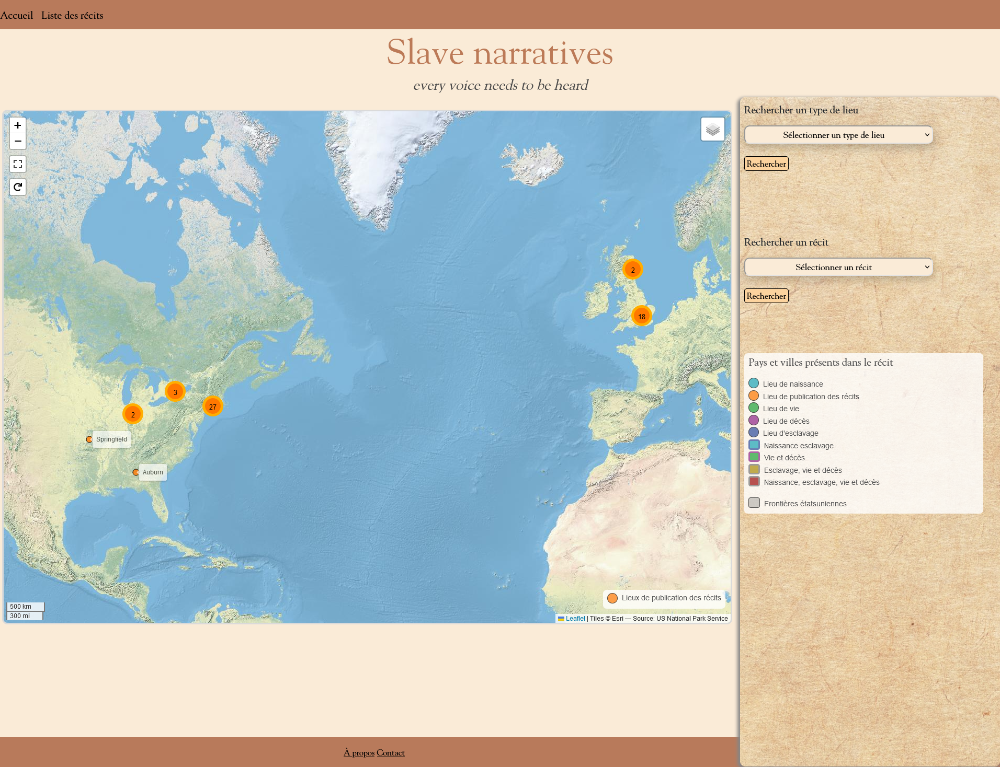
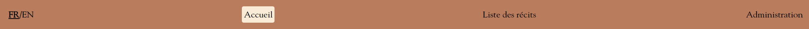
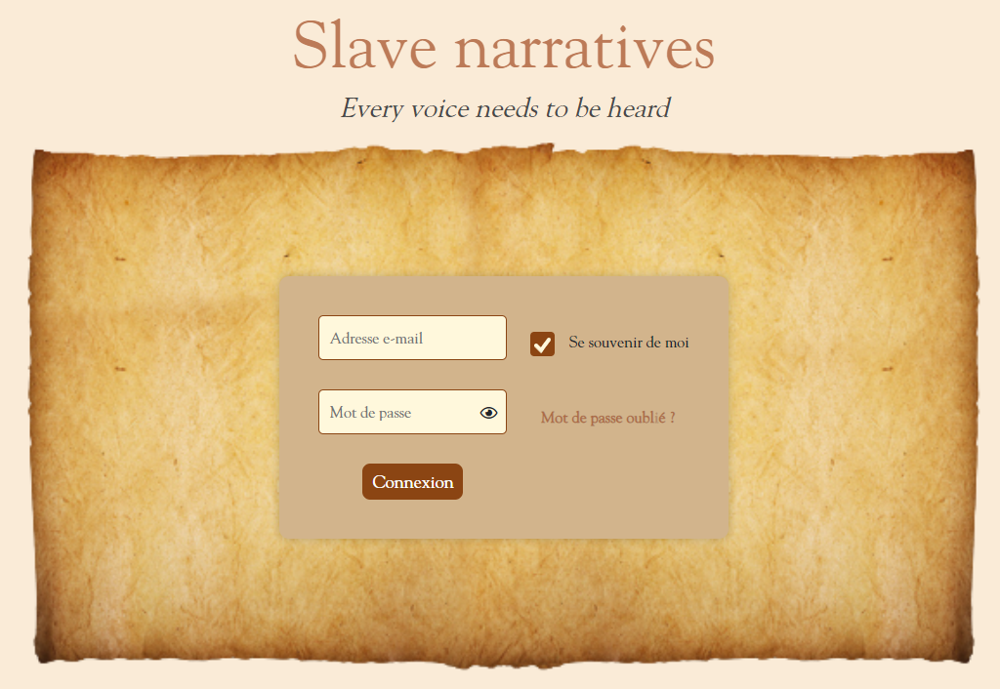

  

  

# Slave Narratives - Documentation utilisateur

<i>Présentée par :

- Esteban BIRET-TOSCANO
- Rémy GUIBERT
- Cédric-Alexandre PASCAL
- Mickael FERNANDEZ</i>

## Sommaire

- [Slave Narratives - Documentation utilisateur](#slave-narratives---documentation-utilisateur)
  - [Sommaire](#sommaire)
  - [Introduction](#introduction)
  - [Esthétique du site](#esthétique-du-site)
    - [Page d'accueil](#page-daccueil)
    - [Page d'à propos](#page-dà-propos)
    - [Page de contact](#page-de-contact)
    - [Page de la liste des récits pt.1](#page-de-la-liste-des-récits-pt1)
    - [Page d'un récit pt.1](#page-dun-récit-pt1)
  - [Partie back-office](#partie-back-office)
    - [Système de connexion](#système-de-connexion)
      - [Cookie](#cookie)
      - [Mot de passe oublié](#mot-de-passe-oublié)
      - [Déconnexion](#déconnexion)
    - [CRUD - Admin](#crud---admin)
      - [Page d'administration](#page-dadministration)
      - [Créer un·e administrateur·rice](#créer-une-administrateurrice)
      - [Modifier mon adresse e-mail](#modifier-mon-adresse-e-mail)
      - [Modifier mon mot de passe](#modifier-mon-mot-de-passe)
      - [Supprimer un·e administrateur·rice](#supprimer-une-administrateurrice)
      - [Page des statistiques](#page-des-statistiques)
    - [CRUD - Esclave/Narrateur](#crud---esclavenarrateur)
      - [Page de la liste des récits pt.2](#page-de-la-liste-des-récits-pt2)
      - [Recensement des esclaves/narrateurs](#recensement-des-esclavesnarrateurs)
      - [Ajouter un esclave/narrateur](#ajouter-un-esclavenarrateur)
        - [Ajout des points](#ajout-des-points)
        - [Suppression d'un point](#suppression-dun-point)
      - [Modifier un esclave/narrateur](#modifier-un-esclavenarrateur)
      - [Supprimer un esclave/narrateur](#supprimer-un-esclavenarrateur)
    - [CRUD - Récit](#crud---récit)
      - [Page d'un récit pt.2](#page-dun-récit-pt2)
      - [Ajouter un récit](#ajouter-un-récit)
        - [Ajout d'une zone géographique](#ajout-dune-zone-géographique)
      - [Modifier un récit](#modifier-un-récit)
      - [Supprimer un récit](#supprimer-un-récit)
      - [Exportation PDF d'un récit](#exportation-pdf-dun-récit)
    - [Langues (FR/EN)](#langues-fren)

## Introduction

Cette documentation utilisateur constitue une référence essentielle pour le projet de rénovation du site web <i>"Slave Narratives"</i> développé par des Masters SIGMA et repris par nous dans le cadre d'une Situation d'Apprentissage et d'Évaluation (SAÉ). Notre objectif visait à améliorer le site web existant, qui regroupe de manière exhaustive de nombreux récits d'esclaves, en proposant une plateforme plus immersive et conviviale pour les administrateurs.
Actuellement, l'exploration de ces récits s'effectue selon différentes approches :

- <b>Localisation géographique</b> : À travers une carte interactive du monde, les utilisateurs peuvent découvrir les récits en fonction de leur lieu d'origine.
- <b>Exploration linéaire</b> : Une liste complète de récits permet une exploration chronologique et détaillée.
- <b>Filtrage personnalisé</b> : Des filtres sont disponibles pour cibler spécifiquement les récits en fonction de critères définis.

L'objectif principal de cette rénovation réside dans l'intégration d'un back-office, qui apportera une profondeur accrue à l'expérience utilisateur. 
Ainsi, cette documentation sert à une prise en main optimale du site web, en tirant parti des nouvelles fonctionnalités et améliorations prévues.

## Esthétique du site

La charte graphique existante devait être respectée : jeux de couleurs et thématique utilisée.
Par exemple, sur n'importe quel onglet en rapport avec <i>Slave Narratives</i>, la présence d'un livre est à signaler :

  

Toutefois, certaines pages nécessitaient d'être retravaillées dues à des incohérences et à une expérience utilisateur moindre.

### Page d'accueil

Sur la page d'accueil, peu de différences fonctionnelles sont à notifier. Pour une question de simplicité, lors de la recherche d'un type de lieu, le filtre de publication sera choisi par défaut.
Par ailleurs, un petit problème d'alignement entre la carte et le menu était présent, désormais correct.

<b>Avant :</b>

  

<b>Après :</b>

  

De plus, étant présent sur l'intégralité des pages, le haut de page a été amélioré sur les points suivants : 
- Possibilité de choisir la langue française ou anglaise selon ses préférences d'utilisation (réévoqué dans la partie [Langues (FR/EN)](#langues-fren));
- Possibilité d'accéder à la partie intranet du site web (réévoqué dans la partie ["back-office"](#partie-back-office));
- Mémorisation de la page sur laquelle l'utilisateur se situe : afin de garantir une navigation pertinente entre chaque page du site web, une surbrillance sera effectuée sur la page actuellement consultée par l'internaute. Le survol des menus, quant à lui, a été conservé.

<b>Avant : </b>

  

<b>Après :</b>

  

Le bas de page reprend exactement le même principe du haut de page, bien qu'une superposition du menu était présente :

<b>Avant :</b>

  

<b>Après :</b>

  

### Page d'à propos

Cette page recense majoritairement la provenance du site web. Néanmoins, les versions françaises et anglaises étaient présentes ensemble et c'est pourquoi, cette distinction se fera désormais par le biais du bouton <i>"FR/EN"</i> situé dans le haut de page. Par ailleurs, certains textes n'étaient pas à jour sur cette page, tout comme son esthétique, qui nécessitaient d'être revus : 

<b>Avant :</b>

  

<b>Après :</b>

  

### Page de contact

À la différence d'un simple texte indiquant qu'il s'agisse de la page de contact, cette dernière se présente sous la forme d'un formulaire dans lequel n'importe quel individu peut joindre les administrateurs·rices, quelle qu'en soit la demande. Lors de l'envoi, ce seront ces mêmes administrateurs·rices qui recevront un mail sur leur adresse de contact :

<b>Avant :</b>

  

<b>Après :</b>

  
  

### Page de la liste des récits pt.1

Une légère modification a été apportée sur la page listant l'ensemble des récits, où désormais, il est aussi possible de recenser l'ensemble des narrateurs (réévoqué dans la partie [Recensement des esclaves/narrateurs](#recensement-des-esclavesnarrateurs)) :

<b>Avant :</b>

  

<b>Après :</b>

  

### Page d'un récit pt.1

Enfin, la page d'un récit a subi de nombreux changements de par sa consistance. En effet, de nombreuses informations étaient présentes sur l'excel (fourni par notre cliente) et non sur le site web. C'est pour cela que ces informations manquantes ont donc été ajoutées dans la base de données avant d'être affichées sur celui-ci. Les boutons ont également été modifiés afin de respecter au mieux le concept, en plus de l'ajout du bouton de l'exportation PDF (réévoqué dans la partie [Exportation PDF d'un récit](#exportation-pdf-dun-récit)) :

<b>Avant :</b>

  

<b>Après :</b>

  

## Partie back-office

Au cœur de ce projet, la partie <b>"back-office"</b> a constitué l'axe central de nos efforts tout au long de son développement. C'est ici que convergent les fonctionnalités cruciales qui se sont avérées essentielles pour répondre aux besoins de notre cliente. Cette section représente le socle du site web amélioré, abritant un ensemble de capacités enrichissantes, déterminantes dans l'optimisation de l'expérience utilisateur.

### Système de connexion

Le <b>"back-office"</b> constitue la face cachée mais cruciale de tout site web. Il s'agit d'une interface réservée aux administrateurs, offrant un accès privilégié et complet à l'ensemble des fonctionnalités de gestion du site. Pour avoir un contrôle total sur les contenus, les utilisateurs et les paramètres du site, l'authentification en tant qu'administrateur·rice est impérative.

C'est ainsi en cliquant sur le bouton <b>Administration</b> depuis le haut de page que vous accédez à la page de connexion, nécessitant une adresse mail et un mot de passe. Évidemment, si un internaute essaye de se connecter, la connexion à la base de données permet de vérifier si les informations saisies par l'utilisateur sont également recensées dans celle-ci et à contrario, un message d'erreur sera affiché :

  

#### Cookie

L'option <b>"Se souvenir de moi"</b> à la connexion repose sur l'utilisation de cookies, de minuscules fichiers texte stockés sur l'ordinateur de l'utilisateur. Lorsque cette option est activée, un cookie est généré et conservé sur le navigateur de l'utilisateur. Cela signifie que même après avoir fermé le navigateur ou redémarré l'ordinateur, l'utilisateur peut être automatiquement identifié lors de sa prochaine visite, évitant ainsi la nécessité de saisir à nouveau ses informations d'identification. 

Cependant, il est important de noter que cette option doit être utilisée avec précaution, surtout sur des ordinateurs partagés ou publics, pour des raisons de sécurité.

#### Mot de passe oublié

Il est possible qu'un·e administrateur·rice vienne soudainement à oublier son mot de passe et c'est pourquoi, cette fonctionnalité intervient. En renseignant alors son adresse mail, un mail sera envoyé à cette dernière avec un lien temporaire lui permettant de réinitialiser son mot de passe :

  
  

Évidemment, le lien ne sera plus accessible du moment que le mot de passe aura été modifié. 

Néanmoins, un internaute pourrait être amené à cliquer sur <b>“Mot de passe oublié”</b> pour essayer d’obtenir un accès in-extremis à l’intranet. De même, une vérification sur l’adresse mail est requise et si cette adresse ne figure pas dans la base de données, un autre message d’erreur sera signalé.

#### Déconnexion

Enfin, la connexion ne peut exister sans la possibilité pour un·e administrateur·rice de pouvoir se déconnecter.
Il est important de noter que lorsque l'administrateur·rice est connecté, le haut de page change et laissant place à deux nouvelles fonctionnalités : <b>"Administration"</b> (redirigeant l'utilisateur vers une nouvelle page) et <b>"Se déconnecter"</b>.

  

Ainsi, en se déconnectant, l'administrateur·rice sera redirigé à nouveau vers le formulaire de connexion.

### CRUD - Admin

L'acronyme <b>CRUD Admin</b>, représentant les quatre opérations fondamentales à savoir <b>C</b>reate (Créer), <b>R</b>ead (Lire), <b>U</b>pdate (Mettre à jour) et <b>D</b>elete (Supprimer), permet à l'administrateur·rice d'effectuer ces actions sur les données contenues dans le site web. 

#### Page d'administration

Comme évoqué plus tôt, une fois connecté, un·e administrateur·rice peut accéder à une page d'administration depuis le bouton <b>"Administration"</b>, recensant l'ensemble des possibilités relatives à la gestion des comptes et de son propre compte :

    

#### Créer un·e administrateur·rice

L'une de ces premières fonctionnalités correspond à la création d'un·e administrateur·rice. Il est nécessaire de gérer un site web à plusieurs si un·e administrateur·rice vient à ne pas avoir la main dessus pour diverses raisons.

Cette page est caractérisée par un formulaire demandant une adresse mail ainsi qu'un mot de passe devant respecter diverses conditions. Logiquement, la création ne pourra se faire si la saisie devient erronée :

    

#### Modifier mon adresse e-mail

La seconde fonctionnalité pour un·e administrateur·rice est de pouvoir modifier son adresse e-mail. Nous avons convenu que ce·tte dernier·ère ne peut modifier l'adresse mail d'un·e autre administrateur·rice si la modification vient à être simultanée ou si l'information venait à ne pas être communiquée en temps et en heure. 

Lorsque la modification est correcte, un mail sera envoyé à l'ancienne adresse mail pour informer que la modification a belle et bien été effectuée depuis le site web. À noter que l'administrateur·rice sera déconnecté·e à la suite de ce changement.

  
  

#### Modifier mon mot de passe

Suivant le même principe que la modification de l'adresse e-mail et reprenant le même formulaire que celui du mot de passe oublié, il est aussi possible à un·e autre administrateur·rice de modifier son mot de passe. Une vérification supplémentaire de renseigner le mot de passe actuel est indispensable si quelqu'un de mal intentionné et connecté sur la session de l'administrateur·rice venait à modifier cette information.

Le nouveau mot de passe doit alors respecter les mêmes conditions pour maximiser ses chances de protection et un mail informant cette modification sera informé à l'adresse mail courante de l'administrateur·rice. Enfin, tout comme la modification de l'adresse e-mail, l'administrateur·rice sera déconnecté·e à la suite de ce changement.

  
  

#### Supprimer un·e administrateur·rice

Enfin, la dernière fonctionnalité de ce <b>CRUD Admin</b> concerne la suppression d'un·e administrateur·rice. À comparer des deux fonctionnalités précédentes, celle-ci est commune à tous·tes les administrateurs·rices. Accompagné d'une liste déroulante énumérant l'ensemble des administrateurs·rices sur le site, il suffit de cliquer sur l'un·e d'entre eux·elles et de valider la suppression pour voir le compte définitivement supprimé. Toutefois, la suppression ne peut s'effectuer si l'administrateur·rice est le seul compte du site web.

    

#### Page des statistiques

Sur cette même page d'administration, vous trouverez plusieurs statistiques. Vous pouvez alors remarquer le nombre de visites reçues aujourd'hui, le nombre total de vues sur les récits aujourd'hui et enfin, le nombre total de vues du mois.

    

Le nombre total de vues du mois est visible sur le graphique en passant sa souris sur le graphique.

    

De plus, il y a un lien vers la page de statistiques, qui contient le nombre de vues par mois. Ces mois sont triés par année. 

    

Encore une fois les valeurs des différents mois sont visible en passant la souris sur le mois correspondant.

    

Vous pouvez modifier l'année en cliquant sur la liste déroulante des années afin de choisir l'année souhaitée. Cela modifiera l'affichage du graphique pour montrer les mois correspondants à l'année choisie, avec leurs nombres de vues respectifs.

    

### CRUD - Esclave/Narrateur

Un récit ne peut exister sans narrateur(s) et c'est pourquoi, la capacité de pouvoir gérer ces narrateurs depuis le site web se révèle primordiale.
Naturellement, en étant connecté sur le site, plus de fonctionnalités seront accessibles et l'interface de certaines pages changeront.  

#### Page de la liste des récits pt.2

En revenant alors sur la page des récits, il est possible d'<b>ajouter un narrateur</b> ou encore d'<b>ajouter un récit</b>, en plus d'avoir la permission de <b>modifier</b> et de <b>supprimer</b> l'un d'entre eux :

    

#### Recensement des esclaves/narrateurs

En plus d'avoir un aperçu de l'ensemble des récits d'esclaves, il est aussi possible d'avoir un listing des narrateurs et de leurs caractéristiques, depuis la page de <b>recensement des narrateurs</b>. La plupart de ces informations sont aussi consultables depuis la page du récit d'esclave concerné.

    

#### Ajouter un esclave/narrateur

Comme déjà constaté lors de la connexion de l'administrateur·rice, il lui est possible, tout comme pour le <b>CRUD Admin</b>, de gérer les différents narrateurs. 

Premièrement, l'ajout d'un narrateur/esclave peut s'effectuer depuis la page <b>"liste des récits"</b> en cliquant sur <b>"Ajouter un narrateur"</b> ou bien à l'ajout d'un récit (même bouton) si le narrateur n'était pas présent sur le site web. À la fin, il suffit de cliquer sur <b>valider</b> pour voir qu'une ligne supplémentaire aura été ajouté dans la liste des narrateurs.

    

##### Ajout des points

Pour ajouter des points concernant un narrateur, par exemple le lieu de naissance, il faut appuyer sur "Ajouter un point" en bas de page, et de nouveaux champs apparaîtront, ensuite, il suffit de choisir le type de point, les coordonnées et le lieu.

    

Ce système de point est capable de créer un nombre illimité de point pour un narrateur.

##### Suppression d'un point

Pour supprimer un point, il faut être connecté et se rendre sur la carte (accueil) et sélectionner un point, un bouton "Supprimer ce point" sera visible en bas du pop-up, dès qu'on clique dessus, le point est supprimé.

    >" src="assets/delete_point.png">

#### Modifier un esclave/narrateur

Deuxièmement, depuis la page de recensements des narrateurs, l'administrateur·rice peut modifier les caractéristiques d'un narrateur en cliquant sur l'image de crayon. L'ensemble des informations du narrateur/esclave sont recensées automatiquement dans les différents champs de texte ainsi que dans la case à cocher. En validant, nous pourrons constater que les nouvelles informations seront affichées également dans la liste des narrateurs ou en retournant sur le formulaire de modification.

    

#### Supprimer un esclave/narrateur

Aussi simple que soit-il, la suppression d'un narrateur/esclave se réalise aussi depuis la page de recensements des narrateurs/esclaves. En cliquant sur la croix du narrateur venant à disparaître, une confirmation de cette suppression sera demandée à l'administrateur·rice. Ainsi, en supprimant le narrateur, l'ensemble de ses récits seront effacés.

    
    

### CRUD - Récit

Constituant l'une des deux demandes principales, la gestion des récits est une fonctionnalité cruciale. Au lieu de recenser l'ensemble des informations de ce dernier sur un tableau excel avant de les basculer sur le site web, il sera possible de l'effectuer directement depuis ce dernier. 

#### Page d'un récit pt.2

La première chose à noter est, qu'en allant sur la page d'un récit, des boutons supplémentaires apparaissent pour gérer le récit existant. Cette possibilité peut également s'effectuer depuis la liste des récits selon l'icône cliqué (comme énoncé auparavant) :

    

#### Ajouter un récit

Afin d'ajouter un récit, il faut être connecté et accéder à la liste des récits. Un bouton <b>"Ajouter un récit"</b> sera alors visible sous le titre <b>"Recensement des récits"</b> :

Une fois le bouton cliqué, vous serez amené sur un formulaire demandant toutes les informations d'un récit, à commencer par le narrateur, qu'il faudra choisir parmi la liste ou en ajouter un nouveau et ensuite, il suffit de remplir les champs un par un jusqu'à la fin.

<i>Apparence du formulaire :</i>

  

##### Ajout d'une zone géographique

Lors de l'ajout d'un récit, si vous souhaitez ajouter le lieu de naissance, d'esclavage, de vie, etc. sans être aussi précis qu'avec un point, il vous suffit de sélectionner la zone géographique correspondante dans le champ voulu et en mettant le type souhaité à la zone voulue :

    

De plus, si vous souhaitez ajouter plusieurs zones géographiques, il suffit de cliquer sur le bouton <b>"Ajouter une zone géographique"</b>, ou <b>"Add a geographical area"</b> en anglais, afin d'ajouter un nouveau champ pour le pays et le type de zone géographique afin de détailler encore plus votre récit :

    

Vous pourrez alors visualiser les zones géographiques que vous avez ajouté depuis la carte présente sur la page d'accueil du site. Vous pouvez d'ailleurs le constater dans l'exemple ci-dessous avec un récit d'Anderson William s'appellant "a" créé uniquement pour l'exemple et étant totalement fictif :

    

#### Modifier un récit

Pour modifier un récit, il faut être connecté et se rendre sur la liste des récits, d'ici vous pourrez voir une colonne "Modifier" à droite du tableau, et en cliquant sur l'icône de crayon correspondant au récit que vous souhaitez modifier vous serez amené au formulaire de modification.

Le formulaire de modification d'un récit est pré-rempli avec les informations déjà existantes :

  

#### Supprimer un récit

Tout comme la suppression d'un narrateur, il suffit simplement de cliquer sur la croix rouge à partir de la liste des récits et de confirmer cette suppression depuis la pop-up affichée en conséquence du clic sur cette même croix pour constater que le récit sera supprimé de la liste. Par ailleurs, si le narrateur du récit supprimé n'était rattaché qu'à ce dernier, il sera également supprimé.

    
    

#### Exportation PDF d'un récit

Une fonctionnalité non demandée mais figurée dans le cahier des charges concerne l'exportation PDF. Concrètement, il est possible, à partir d'une fiche de récit, d'en exporter l'entièreté de son contenu tout en figurant les premières lettres de ce récit dans le nom du fichier. Cela peut se révéler pratique pour avoir une double sauvegarde d'un même contenu ou si le site venait à être en maintenance : 

    

    

### Langues (FR/EN)

Pour finir, il est possible sur le site, de traduire de la version française vers la version anglaise (et réciproquement) l'entièreté du contenu présent. Une fois le changement exécuté depuis le bouton <b>FR/EN</b> présent dans le haut de page, l'ensemble des pages seront traduites. Ainsi, les mails seront également envoyés en anglais tout comme le contenu d'un PDF qui en sera de même. Par exemple, en reprenant la page <b>"à propos"</b> et en ayant sélectionné la version anglaise, l'intégralité du texte a été traduit :

    

